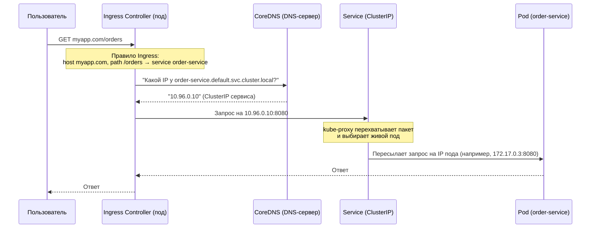
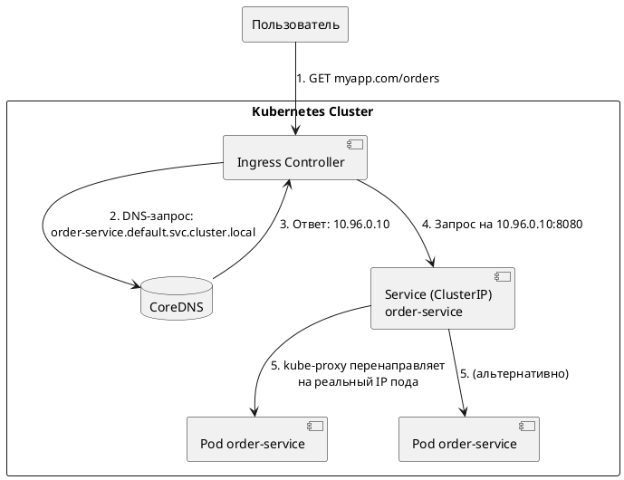

# Проектирование микросервисов

Проектирование микросервисов — это не просто написание кода, а целый комплекс архитектурных решений. Обычно оно включает следующие ключевые области:

## 1. Декомпозиция (Domain-Driven Design)
Это самый важный и сложный этап — как разрезать монолит на сервисы.
*   **Определение границ контекстов (Bounded Contexts):** Сервисы должны совпадать с бизнес-границами (например, «Каталог товаров», «Управление заказами», «Доставка», «Платежи»).
*   **Принципы:**
    *   **Single Responsibility:** Сервис делает одно, но хорошо.
    *   **Слабая связность (Loosely coupled):** Изменение в сервисе А не должно требовать изменения в Б.
    *   **Сильная связанность внутри (High cohesion):** В одном сервисе собираются все связанные функции (например, логика ценообразования живет там же, где и каталог).

## 2. Коммуникация между сервисами (Inter-service Communication)
Как сервисы будут общаться, сохраняя независимость?
*   **Синхронная (request/response):**
    *   *Протоколы:* HTTP (REST API), gRPC (быстрее, строгие контракты Protobuf).
    *   *Проблема:* Создает жесткую связь во времени (сервис Б должен быть жив, когда А делает запрос).
*   **Асинхронная (event-driven):**
    *   *Брокеры сообщений:* RabbitMQ, Apache Kafka, AWS SNS/SQS.
    *   *Схема:* Сервис публикует событие («Заказ оплачен»), другие сервисы (Логистика, Email) подписываются и реагируют независимо.
    *   *Плюс:* Повышает отказоустойчивость и слабую связанность.

## 3. Управление данными (Data Management)
В микросервисах это нетривиально. **Золотое правило:** У каждого сервиса своя собственная БД, и никто не лезет в чужую напрямую.
*   **Database per Service:** Сервис заказов использует PostgreSQL, сервис рекомендаций — MongoDB.
*   **Проблема транзакций:** ACID-транзакции через границы сервисов невозможны. Решение — **Saga Pattern** (цепочка локальных транзакций с компенсирующими действиями, если что-то пошло не так).
*   **Проблема join'ов:** Нельзя сделать `JOIN` между таблицами заказов и клиентов. Решается через денормализацию, агрегаторы или запросы к API.

## 4. Раскрытие API на внешку (API Gateway)
Внутри сервисы могут работать на gRPC, но для фронтенда (браузера) это неудобно. Нужен **шлюз**.
*   **Задачи:** Маршрутизация запросов к нужному сервису, объединение данных из нескольких сервисов в один ответ (агрегация), аутентификация, лимитирование запросов, кросс-доменные запросы (CORS).

## 5. Обнаружение сервисов (Service Discovery)
В мире контейнеров IP-адреса сервисов постоянно меняются. Клиент не может прописать `http://10.0.0.5:8080` статически.
*   **Сервис-реестр:** etcd, Consul, Eureka, ZooKeeper.
*   **Схема:**
    *   *Client-side discovery:* Сервис сам спрашивает реестр («Дай адрес Сервиса-Заказов»).
    *   *Server-side discovery:* Запрос идет через балансировщик (Kubernetes Service), который знает реестр.

## 6. Надёжность и отказоустойчивость (Resilience)
Сеть ненадёжна. С вероятностью 10% сервис Б ответит медленно или упадёт. Нужно защитить систему от каскадного отказа.
*   **Timeouts:** Не ждать ответа вечно.
*   **Паттерны (Resilience4j, Hystrix):**
    *   **Circuit Breaker:** Если сервис Б начинает отвечать ошибками — автоматически перестать слать запросы на 10 секунд, дать ему восстановиться.
    *   **Retry:** Повторить запрос 3 раза, если ошибка временная.
    *   **Bulkhead:** Выделить пул потоков под каждый сервис, чтобы один медленный сервис не «съел» все ресурсы.

## 7. Наблюдаемость (Observability)
У вас 20 микросервисов. Как понять, почему запрос пользователя выполняется 2 секунды?
*   **Централизованное логирование:** все логи (текстовые строки) стекаются в один агрегатор (ELK / Grafana Loki).
*   **Распределённая трассировка (Distributed Tracing):** каждый запрос ID (Trace ID) пробрасывается через все сервисы. Инструменты: **Jaeger, Zipkin**. Вы видите: *API Gateway (10ms) → Сервис Заказов (200ms) → Медленный вызов в БД (180ms)*.
*   **Метрики (Prometheus + Grafana):** Количество запросов в секунду, процентиль латентности (p99), количество ошибок.

## 8. Инфраструктура (CI/CD & Контейнеризация)
Микросервисы бессмысленны без автоматизации.
*   **Контейнеризация:** Docker (каждый сервис — отдельный образ).
*   **Оркестрация:** Kubernetes (основной стандарт) или Docker Swarm. K8s дает: автоподнятие упавших контейнеров, горизонтальное масштабирование (скопировать контейнер 10 раз), канареечные релизы.
*   **CI/CD Pipeline:** (GitLab CI, GitHub Actions, Jenkins) — должен быть отдельный пайплайн для каждого микросервиса, чтобы вы могли выкатить обновление Каталога, не перекатывая Платежи.

## 9. Безопасность
*   **Аутентификация:** Обычно выносится в API Gateway (проверка JWT-токена).
*   **Авторизация (перенос прав внутрь):** Сервис должен сам решать, может ли пользователь удалить заказ. Для этого в токене или заголовках пробрасывают роли / user_id.
*   **mTLS (Mutual TLS):** Для связи между самими микросервисами внутри кластера — шифрование и взаимная аутентификация (например, в Istio).

## Итог: архитектурные решения, которые надо принять **до** начала кодинга:

| Аспект | Вопрос, на который нужно ответить |
| :--- | :--- |
| **Границы сервисов** | По бизнес-функциям или по сущностям (user, order)? |
| **Синхронность** | REST, gRPC или всё через очереди? |
| **Данные** | У каждого своя БД? Как делать саги? |
| **API Gateway** | Свой велосипед или готовый (Kong, Traefik, Nginx)? |
| **Транзакции** | Допустима ли слабая согласованность (eventual consistency)? |
| **Развёртывание** | Docker + K8s или серверные бессерверные (AWS Lambda)? |

Коротко: проектирование микросервисов — это проектирование **распределённой системы**, где код занимает не 90%, а, может быть, 30% усилий. Остальное — сеть, данные, надёжность и операции.


# Проектирование микросервисов в Kubernetes

Да, проектирование микросервисов **под Kubernetes** (K8s) имеет ряд существенных отличий от «абстрактного» проектирования. K8s — это не просто место развертывания, он активно диктует, как вы должны строить архитектуру.

Можно выделить 6 ключевых сдвигов в мышлении:

## 1. От «сервиса» к «контейнеру» и «поду»
В обычном проектировании вы думаете о сервисе как о процессе на виртуальной машине. В K8s вы обязаны думать:
*   **Pod** — минимальная единица (один или несколько контейнеров, которые жестко связаны, разделяют localhost и volume). Проектировать лучше **один контейнер на под**, кроме вспомогательных (sidecar).
*   **Сервис становится stateless настолько, насколько возможно.** Потому что поды в K8s эфемерны: они могут быть убиты, пересозданы, переехать на другой узел. Если микросервис хранит состояние локально на диске — при перезапуске данные потеряются.

**Отличие:** Вы проектируете под автоматическое восстановление и репликацию. «Где живет мой сервис?» заменяется на «Сколько подов мне нужно запустить, и как K8s распределит их по узлам?»

## 2. Service Discovery и балансировка — это встроенные примитивы
В общем проектировании вы обычно ставите ZooKeeper/Consul + библиотеку в коде. В K8s:
*   **Встроенный Service Discovery** через DNS: поды автоматически получают имена вида `my-service.namespace.svc.cluster.local`. Вам не нужно писать код для регистрации сервиса — K8s делает это сам.
*   **Встроенный балансировщик** (ClusterIP / NodePort / LoadBalancer) на уровне L4 (TCP/UDP). При этом **балансировка на уровне L7** (по HTTP path) — это уже Ingress Controller (Nginx, Traefik, Istio), который тоже работает поверх K8s.

**Отличие:** Вы перестаёте беспокоиться о «где найти сервис Б» — K8s даёт стабильный DNS-адрес (несмотря на то, что IP подов меняются). Проектирование упрощается, но вы должны понять модель: Service → Pod selector → Endpoints.

## 3. Сетевые паттерны: Sidecar-контейнеры и Ambient mesh
K8s позволяет запускать в одном поде **два контейнера** (например, основной + sidecar для логирования, метрик, mTLS). Это порождает специфические архитектурные паттерны:
*   **Sidecar proxy** (Envoy, Linkerd) — перехватывает весь трафик пода, обеспечивая observability, retry, circuit breaker **без изменения кода приложения**.
*   **Service Mesh** (Istio, Linkerd) — на основе sidecar'ов даёт сложную маршрутизацию (canary, blue-green), взаимную TLS, distributed tracing «из коробки».

**Отличие:** Многие аспекты надежности (retry, timeout, circuit breaker) можно вынести из кода в инфраструктуру K8s. Проектируя микросервис, вы решаете: «Буду ли я использовать сервис-меш? Если да, то мой код может быть проще — без библиотек Resilience4j».

## 4. Управление состоянием: Persistent Volumes и StatefulSet
В общем проектировании микросервисов часто советуют делать всё stateless. Но в реальности бывают базы данных, очереди, кэши, которые тоже хотят жить в K8s. И здесь отличие критическое:
*   **Stateless микросервис** → Deployment (перезапуск, масштабирование).
*   **Stateful микросервис** (например, свой экземпляр Kafka, PostgreSQL, Redis с сохранением данных) → **StatefulSet** + PersistentVolumeClaim.
    *   Поды получают стабильные имена (pod-0, pod-1...), сохраняют порядок запуска.
    *   Хранилище (PV) привязывается к поду — даже если под переедет на другой узел, диск монтируется заново.

**Отличие:** Проектируя базу данных внутри K8s, вы должны учитывать бэкапы, восстановление, производительность дисков и то, что StatefulSet хуже масштабируется. Для многих команд проще вынести базы данных за пределы K8s (RDS, Cloud SQL), а в K8s оставлять только stateless приложения. **Это осознанное архитектурное решение**.

## 5. Конфигурация и секреты: ConfigMap и Secret
В обычных микросервисах вы используете переменные окружения, файл конфигурации на диске или сервис типа Vault. В K8s:
*   **ConfigMap** — хранит несекретные настройки (url внешнего API, уровень логирования). Может быть подмонтирован как файл или переменная окружения.
*   **Secret** — base64 (слабое шифрование, но можно включить шифрование etcd) для токенов, паролей. + часто используют внешние провайдеры (Secrets Store CSI Driver + Vault/AWS Secrets Manager).

**Отличие:** Вы должны проектировать микросервис так, чтобы он читал конфигурацию из переменных окружения или файлов (`/etc/config/*`), а не из жестко зашитых путей или параметров запуска. Это повышает портируемость.

## 6. CI/CD и GitOps стратегия
Проектирование микросервисов в K8s тесно связано с тем, как вы будете их обновлять:
*   **Не просто отдельный pipeline для каждого сервиса**, но и **стратегия обновления**:
    *   RollingUpdate (постепенная замена подов) — стандарт.
    *   Blue/Green или Canary — требуют более сложных контроллеров (Argo Rollouts, Flagger).
*   **GitOps** (ArgoCD, Flux): декларативное состояние всего кластера в Git. У вас не «запушить образ на прод», а «обновить манифест в Git, а оператор сам синхронизирует».

**Отличие:** Ваш артефакт — Docker-образ + набор YAML-манифестов (Deployment, Service, ConfigMap, Ingress). Проектирование включает в себя структурирование этих манифестов (например, Helm-чарты или Kustomize), чтобы можно было переиспользовать их для разных окружений (dev/staging/prod).

## Итог: что меняется в проектировании таблицей

| Аспект | Обычное проектирование | Проектирование под Kubernetes |
| :--- | :--- | :--- |
| **Состояние сервиса** | Допустимо локальное состояние (файлы, in-memory кэш) | Строго stateless, либо StatefulSet + PV |
| **Service discovery** | Пишем клиент к Consul / Eureka / ZooKeeper | Используем встроенный DNS: `service-name.namespace` |
| **Балансировка и надежность** | В коде (Retry, Circuit Breaker) | Можно вынести в Service Mesh (Istio) или Ingress |
| **Конфигурация** | Файл `application.yml`, env из системы | ConfigMap / Secret + возможность горячей перезагрузки |
| **Адресация между сервисами** | IP + порт, нужно обновлять при переезде | Стабильный ClusterIP или DNS. Но иногда требуется Headless Service |
| **Жизненный цикл** | Процесс на VM, supervisor | Pod: liveness/readiness пробы, graceful shutdown, preStop hook |
| **Логи и мониторинг** | Агент на VM собирает логи | Каждый pod пишет stdout/stderr → сбор через Fluentd/Loki + метрики через Prometheus Operator |

### Совет:
Проектируя новый микросервис **специально для K8s**, сразу закладывайте:
*   Хранение конфигурации в ConfigMap (не в коде).
*   Сбор метрик в формате Prometheus (endpoint `/metrics`).
*   Поддержку graceful shutdown (сигнал SIGTERM) и readiness/liveness пробы (HTTP endpoint `/health`).
*   Возможность запуска **нескольких реплик** (stateless) — даже если сейчас нужна 1.

Это позволит вам использовать все преимущества оркестрации и не переписывать сервис заново, когда K8s решит перезапустить ваш под на другом узле.

# Настройка аутентификации и авторизации

После того как вы перенесли всю ответственность за маршрутизацию на `Ingress`, закономерный вопрос — куда теперь деть аутентификацию. Хорошая новость в том, что для этого сценария Kubernetes и Spring предлагают очень элегантное и надёжное решение.

Вместо того чтобы подключать Spring Cloud Gateway для перенаправления в Keycloak, мы вынесем обработку сессий и первоначальной аутентификации на уровень Ingress, а сам Keycloak сделаем обычным `Resource Server`:

1.  **Уровень Ingress (Периметр безопасности):** Здесь живет `OAuth2-Proxy`. Он перехватывает все входящие запросы, и если пользователь не авторизован, перенаправляет его на страницу логина Keycloak. После успешного входа он внедряет JWT-токен в запрос.
2.  **Уровень Приложения (Сервисы):** Все ваши микросервисы, включая `Spring Cloud Gateway` (если он пока остаётся), настраиваются как **OAuth2 Resource Server**. Их задача — только **валидировать JWT-токен** (проверить подпись и срок действия), но не заниматься процессом входа (логином).

Этот подход инкапсулирует сложность OAuth2 в инфраструктурном слое, оставляя вашему коду лишь чистую проверку JWT.

## 🛡️ Этап 1: Защита периметра с помощью OAuth2-Proxy

Это ключевой инструмент, который связывает ваш `Ingress Nginx` и `Keycloak`.

1.  **Установите OAuth2-Proxy в ваш кластер.** Лучше всего использовать официальный Helm-чарт для простоты настройки и обновлений.
2.  **Настройте его подключение к вашему `Realm` и `Client` в Keycloak.**
    * В конфигурацию прокси нужно передать `client-id`, `client-secret` и URL вашего Keycloak (например, `https://keycloak.example.com/auth`).
    * Критически важно установить корректный `redirect-url` — это должен быть внешний адрес вашего сервиса или `Ingress`, который вы будете защищать.
3.  **Обновите ваш `Ingress`-ресурс**, добавив в него специальные `annotations`. Именно они подключают наш `OAuth2-Proxy` в цепочку обработки запроса:
    ```yaml
    apiVersion: networking.k8s.io/v1
    kind: Ingress
    metadata:
      name: my-app-ingress
      annotations:
        # Адрес, куда Nginx будет отправлять запрос на проверку аутентификации
        nginx.ingress.kubernetes.io/auth-url: "http://oauth2-proxy.oauth2-proxy.svc.cluster.local:80/oauth2/auth" 
        # Адрес для редиректа, если пользователь не залогинен
        nginx.ingress.kubernetes.io/auth-signin: "https://auth.example.com/oauth2/start?rd=$scheme://$host$request_uri"
    spec:
      # ... ваши правила
    ```
    Теперь каждый запрос к вашему приложению сначала попадет в `OAuth2-Proxy`.

## ✅ Этап 2: Валидация JWT в ваших микросервисах

Теперь, когда `OAuth2-Proxy` перенаправляет пользователя на вход и получает токен, он передает его дальше в ваш микросервис в HTTP-заголовке `Authorization: Bearer <JWT-токен>`. Наша задача — настроить микросервисы на его проверку.

### 1. Настройка `Spring Cloud Gateway` как `Resource Server`

Поскольку вы рассматривали его использование, вы можете оставить `Spring Cloud Gateway` для сложной маршрутизации, но его роль в безопасности изменится:

1.  **Добавьте зависимость** в ваш `pom.xml` (или `build.gradle`):
    ```xml
    <dependency>
        <groupId>org.springframework.boot</groupId>
        <artifactId>spring-boot-starter-oauth2-resource-server</artifactId>
    </dependency>
    ```
2.  **Настройте `application.yml`**, указав, от кого и как принимать токены. Ключевой параметр — `jwk-set-uri`, откуда Spring будет получать публичные ключи для проверки подписи JWT без обращения к Keycloak на каждый запрос:
    ```yaml
    spring:
      security:
        oauth2:
          resourceserver:
            jwt:
              # Внутренний URL для валидации токенов внутри кластера
              jwk-set-uri: http://keycloak-service.keycloak-namespace.svc.cluster.local:8080/realms/your-realm/protocol/openid-connect/certs
    ```
3.  **Минимальная конфигурация безопасности** (сделать все эндпоинты защищенными):
    ```java
    @Configuration
    @EnableWebFluxSecurity
    public class SecurityConfig {
        @Bean
        public SecurityWebFilterChain springSecurityFilterChain(ServerHttpSecurity http) {
            http
                .authorizeExchange(exchanges -> exchanges
                    .anyExchange().authenticated()
                )
                .oauth2ResourceServer(ServerHttpSecurity.OAuth2ResourceServerSpec::jwt);
            return http.build();
        }
    }
    ```

### 2. Настройка обычных `Spring Boot` микросервисов

Для всех остальных (`@RestController`) сервисов конфигурация будет практически идентичной.

1.  Добавьте ту же зависимость `spring-boot-starter-oauth2-resource-server`.
2.  Аналогично укажите `jwk-set-uri` в `application.properties`:
    ```properties
    spring.security.oauth2.resourceserver.jwt.jwk-set-uri=http://keycloak-service.keycloak-namespace.svc.cluster.local:8080/realms/your-realm/protocol/openid-connect/certs
    ```
3.  Так же настройте `SecurityFilterChain` через код.


### ⚠️ «Головная боль»: Проблема internal vs external URL

Это наиболее частая проблема, с которой сталкиваются при такой настройке.

*   **В чем суть:** JWT-токен, который выдает Keycloak, содержит внутри себя поле `iss` (issuer).
*   **Внешний пользователь** получает токен от Keycloak по внешнему URL, например, `https://keycloak.example.com/auth/realms/your-realm`.
*   **Ваш внутренний микросервис** в валидаторе ожидает увидеть `iss` равным своему внутреннему `jwk-set-uri` (например, `http://keycloak-service...`). Они **не совпадут**, и валидация выдаст ошибку.

#### 🔧 Решения:

1.  **Базовая настройка Keycloak:** Установите переменную окружения `KEYCLOAK_FRONTEND_URL` в вашем `Deployment` Keycloak равной его внешнему адресу (`https://keycloak.example.com/auth`). Это заставит Keycloak формировать правильные ссылки.
2.  **Настройка сервисов на внешний URL (Проще):** Самый простой путь — с самого начала сконфигурировать все ваши микросервисы на **внешний** `jwk-set-uri`. **Но это будет работать, только если ваши поды имеют доступ в интернет**.
3.  **Настройка сервисов через внутренний URL (Надёжнее):** Договоритесь с администраторами вашего Keycloak, чтобы он публиковал JWKS-эндпоинт **и по внутреннему, и по внешнему адресу**. Тогда вы сможете задать `jwk-set-uri` как внутренний `http://keycloak-service...`.


### 💎 Итоговая архитектура

Подводя итог, итоговая схема будет выглядеть так:

1.  Пользователь заходит на ваш сайт (`https://app.example.com`).
2.  `Ingress Nginx` перехватывает запрос и, увидев `auth-url`, отправляет запрос в `OAuth2-Proxy`.
3.  `OAuth2-Proxy` видит, что пользователь не аутентифицирован, и отправляет ему редирект (HTTP 302) на страницу логина `Keycloak` (`https://keycloak.example.com`).
4.  Пользователь вводит логин/пароль на странице Keycloak.
5.  Keycloak проверяет данные и отправляет обратно `authorization code`.
6.  `OAuth2-Proxy` обменивает этот код на `JWT Access Token`.
7.  `OAuth2-Proxy` отправляет запрос дальше, уже вместе с `Authorization: Bearer ...` на ваш микросервис.
8.  Ваш `Spring Boot` (или `Spring Cloud Gateway`) получает запрос, проверяет подпись токена через `jwk-set-uri` и пропускает запрос.

Эта архитектура позволяет безопасно убрать Spring Cloud Gateway из цепи аутентификации, оставив ему только прямые обязанности, и полностью легитимно использовать все преимущества Kubernetes Ingress.

============
-


# Простая схема авторизации в микросервисах


Вы абсолютно правы, что заострили на этом внимание — этот момент часто вызывает путаницу.
Короткий ответ: Да, Keycloak отдает код браузеру, а возвращает его обратно тоже браузер, но делает он это автоматически по указанию Keycloak. Сам Ingress в этом обмене кодами вообще не участвует — он работает просто как «телефонный провод», который перекидывает запросы.
Давайте разберем этот критический момент «на пальцах» — без сложной терминологии, шаг за шагом.
------------------------------
## Подробный разбор магии с кодом (Authorization Code)
Представьте, что Keycloak — это закрытый сейф, а браузер — это курьер.
## Шаг 1: Keycloak отдает код браузеру
Когда пользователь ввел правильный пароль на странице Keycloak, Keycloak не может напрямую вызвать ваш сервис внутри Kubernetes (он не знает, какому именно поду внутри кластера это нужно).
Поэтому Keycloak дает этот одноразовый код (code=XYZ) браузеру пользователя. Но дает его хитрым способом — в виде HTTP-ответа 302 Redirect.
Внутри этого ответа написано: «Браузер, немедленно перейди по адресу https://my-app.com».
## Шаг 2: Браузер автоматически возвращает код обратно
Браузер получает этот ответ 302. Пользователь при этом ничего не нажимает — браузер сам, автоматически выполняет эту команду.
Он берет эту ссылку с кодом на конце и делает по ней запрос. Этот запрос летит через интернет, проходит сквозь Ingress и попадает на ваш бэкенд-сервис (или API Gateway), который отвечает за авторизацию.
## Шаг 3: Зачем нужен этот промежуточный бэкенд-сервис?
Ваш бэкенд-сервис «ловит» этот запрос с кодом XYZ. Теперь сервис делает то, что браузер сделать не может: он берет этот код, идет с ним напрямую в Keycloak внутри сети Kubernetes и говорит: «Мне тут браузер принес код XYZ. Это правда твой код?».
Keycloak сверяет код и только тогда отдает вашему сервису настоящие, секретные JWT-токены.
------------------------------
## Почему нельзя было сразу отдать JWT-токен браузеру на Шаге 1?
Этот длинный путь с кодом придуман исключительно ради безопасности:

   1. Защита от перехвата в истории браузера: Если бы Keycloak сразу вставил длинный JWT-токен в адресную строку (URL) при редиректе, этот токен навсегда остался бы в истории браузера, логах провайдеров и мог быть украден вредоносными расширениями.
   2. Одноразовость кода: Код XYZ живет всего несколько секунд и работает ровно один раз. Даже если злоумышленник перехватит его из URL, он не сможет обменять его на токен, потому что ваш бэкенд уже активировал его.
   3. Проверка подлинности бэкенда: Когда бэкенд меняет код на токен, он передает в Keycloak свой собственный секретный пароль (Client Secret). Это доказывает Keycloak, что токен забирает именно ваше доверенное приложение, а не хакерский сайт-клоун.

Стало ли понятнее, как браузер выступает «посыльным» между Keycloak и вашим бэкендом?
Если хотите, мы можем посмотреть, как выглядит этот обмен в консоли разработчика (F12) в браузере, чтобы вы увидели эти редиректы вживую.


Да, вы абсолютно правы! Вы точно уловили суть. В этой схеме (она называется паттерном BFF — Backend-for-Frontend) настоящие JWT-токены от Keycloak получает именно Gateway, а не браузер.
Браузер эти токены даже не видит. Давайте разберем, как Gateway управляет этим процессом и пропускает запросы дальше.
------------------------------
## Как работает схема, когда токен оседает на Gateway
После того как Gateway обменял временный код на JWT-токены, запускается следующий механизм:
## 1. Сохранение токена (внутри кластера)
Gateway получает от Keycloak пару токенов: Access Token (короткоживущий, для авторизации) и Refresh Token (для обновления первого).

* Gateway не отдает их в браузер.
* Он сохраняет их у себя в памяти или в быстром кэше (например, в Redis), привязывая к уникальному ID сессии.

## 2. Маскировка для браузера (Куки)
Браузеру вместо тяжелого и опасного JWT-токена возвращается обычная сессионная кука (Session Cookie).

* В куке записан только случайный набор символов (ID сессии).
* На эту куку вешаются флаги безопасности HttpOnly (js-скрипты не могут её украсть) и Secure (передается только по HTTPS).

## 3. Пропуск запроса дальше (Трансформация заголовков)
Когда пользователь хочет получить данные (например, список товаров), происходит магия трансформации запроса на Gateway:

[ Браузер ] --( Cookie: session_id=abc123 )--> [ Gateway ] --( Authorization: Bearer JWT )--> [ Сервис товаров ]


   1. Браузер делает запрос к API и автоматически прикрепляет куку: Cookie: session_id=abc123.
   2. Gateway перехватывает запрос и смотрит на куку.
   3. По значению abc123 Gateway лезет в свой кэш/Redis и достает оттуда реальный Access Token (JWT), который там лежит.
   4. Gateway удаляет заголовок Cookie из запроса (чтобы внутренние сервисы про куки вообще ничего не знали).
   5. Gateway добавляет новый заголовок Authorization: Bearer <строка_JWT_токена>.
   6. В таком измененном виде Gateway перенаправляет запрос дальше во внутренний микросервис.

------------------------------
## Почему внутренний сервис доволен?
Внутреннему сервису (например, сервису заказов или товаров) абсолютно всё равно, откуда взялся этот JWT-токен. Он просто видит стандартный заголовок Authorization: Bearer ..., быстро проверяет подпись Keycloak (математически, с помощью публичного ключа, как мы разбирали раньше) и отдает данные.
## Главный плюс такой схемы
Полная безопасность на фронтенде. Если хакер сможет провернуть XSS-атаку (внедрить вредоносный JS-скрипт на ваш сайт), он не сможет украсть токен, потому что токена в браузере просто нет, а кука защищена флагом HttpOnly.
Если хотите, мы можем разобрать:

* Что делает Gateway, когда Access Token протухает (как он автоматически использует Refresh Token без участия пользователя).
* Как выглядит пример настройки такого проксирования в Kubernetes.

Вам интересно узнать, как поддерживается сессия, когда токен «умирает» через 5-15 минут?


Нет, код, который возвращает Keycloak, не содержит внутри себя ни логина, ни пароля пользователя.
Логин и пароль пользователя остаются внутри Keycloak и больше никогда и никуда не передаются — ни в браузер, ни бэкенду (Gateway). В этом и заключается главная идея безопасности протокола OAuth 2.0 / OIDC.
Давайте разберем, что на самом деле представляет собой этот код и как Keycloak понимает, кому выдать JWT-токен.
------------------------------
## Что такое Authorization Code (Ответный код) на самом деле?
Этот код (например, code=SplxlOBeZQQYbYS6WxSbIA) — это просто случайный, временный секретный идентификатор (случайная строка).
Его можно сравнить с номерком в гардеробе:

   1. Вы сдали куртку (ввели логин/пароль в Keycloak).
   2. Гардеробщик (Keycloak) повесил куртку в надежное место, а вам выдал пластмассовый номерок (код). На самом номерке нет описания вашей куртки, вашего имени или адреса. Это просто случайное число.
   3. Вы отдаете этот номерок своему другу-курьеру (Gateway).
   4. Курьер (Gateway) подходит к гардеробу, показывает номерок, и гардеробщик (Keycloak) выдает ему пакет с вещами (JWT-токенами).

------------------------------
## Как это выглядит на уровне базы данных Keycloak?
Когда вы успешно ввели логин и пароль на странице Keycloak, внутри оперативной памяти Keycloak создается временная запись (сессия):

* Keycloak запоминает: «Так, только что успешно авторизовался пользователь Иван (user_id: 123). Для этой сессии я сгенерировал случайный код SplxlOBeZQQYbYS6WxSbIA. Этот код сгорит через 1 минуту».

Когда ваш Gateway забирает этот код у браузера и отправляет его обратно в Keycloak, происходит следующий диалог:

   1. Gateway говорит Keycloak: «Привет, обменяй мне код SplxlOBeZQQYbYS6WxSbIA на JWT-токен».
   2. Keycloak ищет у себя в памяти: «Так, код совпадает. Этот код был создан для пользователя Иван (user_id: 123)».
   3. Keycloak генерирует JWT-токен: Он берет данные Ивана (его ID, имя, роли, email), упаковывает их в JSON, подписывает своей цифровой подписью и отдает Gateway.

Внутри этого JWT-токена будут лежать права Ивана, но пароля там не будет. Пароль вообще стерся из памяти сразу после проверки на этапе логина.
------------------------------
## Почему это безопасно?
Если бы в коде или в JWT-токене содержался пароль, это уничтожило бы всю безопасность:

* Пароль мог бы перехватить Gateway (а бэкенд-разработчики не должны знать пароли пользователей).
* Пароль мог бы утечь при проксировании трафика.

В схеме с Keycloak пароль знает только сам Keycloak, который проверяет его один раз в момент ввода. Все остальные сервисы работают исключительно с JWT-токенами, подтверждающими, что пользователь уже успешно проверен.
Если хотите, мы можем посмотреть:

* Что именно написано внутри JWT-токена (какие поля вроде sub, exp, roles туда зашивает Keycloak).
* Как Keycloak защищает этот временный код от перехвата с помощью технологии PKCE (Proof Key for Code Exchange).

Хотите увидеть пример содержимого типичного JWT-токена пользователя?


Да, в этой ситуации сервисы обязательно передают токены дальше. Сервис заказов не может пойти в сервис оплаты «просто так» — сервис оплаты тоже потребует подтверждения прав.
В микросервисной архитектуре этот процесс называется пробросом токена (Token Propagation). Существует два основных способа, как это организуют на практике.
------------------------------
## Вариант 1: Паттерн Token Relay (Проброс токена пользователя)
Это самый популярный и простой подход. Сервис заказа просто берет тот же самый JWT-токен, с которым к нему пришел пользователь, и пересылает его в сервис оплаты.

[ Gateway ] --( JWT Ивана )--> [ Сервис Заказов ] --( JWT Ивана )--> [ Сервис Оплаты ]


   1. Сервис Заказов получает запрос от Gateway. В заголовке Authorization лежит JWT-токен Ивана.
   2. Сервис Заказов делает свою работу (создает заказ в базе данных).
   3. Когда ему нужно вызвать Сервис Оплаты, он делает HTTP-запрос (или gRPC-вызов) к нему.
   4. При формировании этого запроса разработчик в коде (или через специальный интерцептор/клиент) копирует заголовок Authorization: Bearer <JWT Ивана> из исходного запроса и вставляет его в новый запрос к сервису оплаты.
   5. Сервис Оплаты получает токен, проверяет подпись Keycloak и видит: «Запрос пришел от Сервиса Заказов, но выполняется он от лица пользователя Ивана». Сервис оплаты проверяет, есть ли у Ивана деньги или права на оплату, и проводит транзакцию.

Плюс: Сервис оплаты точно знает контекст пользователя (кто платит, какие у него роли).
Минус: Если цепочка вызовов очень длинная (Сервис А -> Б -> В -> Г -> Д), токен пользователя долетает до самых глубин архитектуры, что не всегда нужно из соображений безопасности.
------------------------------
## Вариант 2: Паттерн Client Credentials + Token Exchange (Системные токены)
Этот подход используется, если сервис оплаты должен выполнить действие не «от лица Ивана», а как системная техническая задача, либо если токен пользователя нужно скрыть.

[ Сервис Заказов ] --( Запрос авторизации )--> [ Keycloak ]
       ^                                             |
       |----------------( Token Сервиса )------------+
       |
       v
[ Сервис Заказов ] --( Token Сервиса )-----> [ Сервис Оплаты ]


   1. Сервис Заказов имеет свою личную (техническую) учетную запись в Keycloak (Client ID и Client Secret).
   2. При старте или по необходимости Сервис Заказов идет в Keycloak по флоу Client Credentials и говорит: «Я Сервис Заказов, вот мой секретный ключ. Дай мне мой собственный токен».
   3. Keycloak выдает JWT-токен, где в качестве субъекта указан сам service-orders, а в ролях написано, например, role: can-initiate-payment.
   4. Сервис Заказов идет в Сервис Оплаты со своим собственным системным токеном, а данные Ивана (например, user_id: 123) передает просто как обычное поле в JSON-теле запроса.
   5. Сервис Оплаты проверяет токен и видит: «Так, подпись верна. Ко мне стучится доверенный Сервис Заказов. Ему разрешено проводить оплаты. Провожу платеж для юзера 123».

Плюс: Полная изоляция. Внутренние сервисы общаются между собой на уровне сервисных прав. Токен пользователя не гуляет по всей сети.
Минус: Сервису оплаты приходится безоговорочно верить Сервису Заказов, что юзер 123 действительно нажал кнопку «Оплатить», так как прямой цифровой подписи Ивана в этом запросе уже нет.
------------------------------
## Как это автоматизируют в Kubernetes?
Чтобы разработчики не писали вручную код проброса заголовков в каждом микросервисе, используют автоматизацию:

* В коде: Использование готовых библиотек (например, FeignClient в Spring Boot или интерцепторы в Axios/HttpClient), которые автоматически перекладывают заголовок Authorization из входящего контекста потока (ThreadLocal) в исходящий запрос.
* В инфраструктуре (Service Mesh): Если в кластере развернут, например, Istio, его прокси-контейнеры (sidecar) могут быть настроены так, чтобы автоматически шифровать и авторизовать трафик между подами (mTLS), подтверждая легитимность вызова Сервис Заказов -> Сервис Оплаты на сетевом уровне.

Если хотите, мы можем детальнее разобрать:

* Как настроить Keycloak Client Credentials для технического токена сервиса.
* Как выглядит код интерцептора для автоматического проброса токена (например, на Java/Spring, Go или Node.js).

Какой из двух подходов (пробрасывать токен пользователя или использовать технический токен сервиса) вам кажется более правильным для вашей задачи?


В контексте Kubernetes вы абсолютно правы: цепочка трафика разворачивается снаружи внутрь. LoadBalancer принимает трафик из интернета, передает его на Ingress, а Ingress направляет запрос на Gateway (хотя эти роли часто совмещаются).
Давайте разберем всю цепочку по шагам, кто за что отвечает и в каком порядке они стоят.
------------------------------
## Архитектурная цепочка прохождения трафика

 [Интернет] 
     │
     ▼
 1. LoadBalancer (Внешний облачный или «железный» балансировщик)
     │
     ▼
 2. Ingress Controller (Nginx, Traefik, HAProxy внутри кластера)
     │
     ▼
 3. API Gateway (Spring Cloud Gateway, Kong, KrakenD — как отдельный Pod)
     │
     ▼
 4. Kubernetes Service (Виртуальный IP-адрес для группы подов)
     │
     ▼
 5. Контейнер приложения (Ваш микросервис в Поде)

------------------------------
## Подробная роль каждого компонента## 1. LoadBalancer (Внешний вход)

* Кто это: Это внешняя сущность по отношению к самому кластеру Kubernetes. Если вы в облаке (Yandex Cloud, AWS, GCP), это облачный балансировщик. Если кластер «на своем железе» (bare-metal), это может быть решение вроде MetalLB или аппаратный балансировщик (F5, HAProxy).
* Что делает: Встречает пользователя в интернете. Он привязан к вашему внешнему статическому IP-адресу (например, 8.8.8.8). Его единственная задача — принять TCP/UDP трафик из интернета и перенаправить его на рабочие ноды (серверы) Kubernetes, прямо в порты Ingress-контроллера. Он не знает про ваши микросервисы и роутинг.

## 2. Ingress Controller (Точка входа в кластер)

* Кто это: Специальный под (или группа подов) внутри Kubernetes (например, ingress-nginx, Traefik, Emissary-ingress).
* Что делает: Это «регулировщик» на границе кластера.
* Он терминирует SSL/TLS (расшифровывает HTTPS-трафик, на нем лежат SSL-сертификаты).
   * Он смотрит на домен и путь в HTTP-запросе (например: если запрос на ://my-app.com, то направить его в один сервис, а если на ://my-app.com — в другой).

## 3. API Gateway (Бизнес-логика маршрутизации)

* Кто это: В зависимости от архитектуры, роль Gateway может выполняться двумя разными способами:
* Способ А (Отдельный слой приложений): Это ваш собственный или готовый микросервис (например, Spring Cloud Gateway, Kong, KrakenD, Zuul), развернутый как обычный Pod в Kubernetes. Ingress направляет весь трафик /api/* сначала на этот Gateway.
   * Способ Б (Совмещенный): Современные Ingress-контроллеры (например, Traefik, Kong, или решения на базе нового Kubernetes Gateway API) умеют работать и как Ingress, и как API Gateway одновременно.
* Что делает: В отличие от технического Ingress, Gateway решает бизнес-задачи:
* Интеграция с Keycloak: Именно он проверяет сессии, обменивает коды на JWT и пробрасывает токены вглубь кластера (как мы разбирали в схеме BFF).
   * Rate Limiting: Ограничивает количество запросов от одного пользователя (например, не более 10 запросов в секунду), чтобы приложение не легло от DDoS.
   * Трансформация запросов: Может изменять заголовки, склеивать ответы от разных микросервисов (Request Aggregation).

## 4. Kubernetes Service (Внутренний балансировщик)

* Кто это: Абстракция, виртуальный IP-адрес внутри сети Kubernetes.
* Что делает: Микросервисы постоянно перезапускаются, и их реальные IP-адреса меняются. Service предоставляет один постоянный внутренний адрес (например, http://orders-service). Gateway отправляет запрос на Service, а Service балансирует этот запрос между живыми подами этого микросервиса.

## 5. Под с вашим приложением

* Конечная точка, куда прилетает очищенный, проверенный, авторизованный запрос с заголовком Authorization: Bearer <JWT>.

------------------------------
## Резюме: краткая шпаргалка

* LoadBalancer — дает внешний IP-адрес и заводит трафик на серверы кластера.
* Ingress — разбирает домены, пути (/api, /auth) и расшифровывает HTTPS.
* API Gateway — проверяет авторизацию в Keycloak, защищает от перегрузок и управляет логикой API.
* Service — находит живые поды приложения внутри кластера.

Если хотите, мы можем обсудить:

* Стоит ли вам ставить отдельный API Gateway (например, Spring Cloud Gateway) или лучше настроить все функции внутри Ingress (например, Traefik/Kong).
* Как работает новый стандарт Kubernetes Gateway API, который сейчас активно заменяет старый Ingress.

Вы уже выбрали конкретный Ingress-контроллер для своего кластера (Nginx, Traefik, что-то другое)?


# Kubernetes API Gateway

Kubernetes Gateway API — это официальный, полностью переработанный стандарт управления трафиком, который пришел на замену старому Ingress. Разработчики ядра Kubernetes признали, что Ingress устарел: его возможностей не хватает для современного веба, а сам он превратился в «кладбище аннотаций». [1, 2, 3, 4] 
В общих чертах суть нового стандарта сводится к трем главным изменениям: разделению ролей, избавлению от аннотаций и нативной поддержке сложных сценариев. [5, 6] 
------------------------------
## 1. Разделение обязанностей (Ролевой подход)
В старом Ingress за всё отвечал один-единственный YAML-файл. В нем смешивались настройки инфраструктуры (SSL-сертификаты, IP-адреса балансировщика) и настройки приложения (пути /api/orders). Это приводило к бардаку с правами доступа. [2, 4, 7, 8] 
Gateway API разбил один ресурс на три независимых объекта, которые настраивают разные люди: [3, 9] 

[ Инфраструктурный провайдер ] ──► GatewayClass (Шаблон инфраструктуры)
                                         │
[ Системные администраторы ]   ──► Gateway (Входная точка: порты, SSL/TLS, IP)
                                         │
[ Разработчики приложений ]    ──► HTTPRoute / GRPCRoute (Правила маршрутизации)


* GatewayClass (делает Инфраструктурщик / Облако): Описывает, какой именно балансировщик используется (например, Envoy, Nginx, AWS, Cilium). [8, 9] 
* Gateway (делает Админ / Platform Team): Описывает физическую точку входа — на каком порту слушать трафик (80, 443), какие SSL-сертификаты подключить и какие домены разрешить. [8] 
* HTTPRoute / GRPCRoute (делают Разработчики): Описывает чисто логику приложения. Разработчик просто пишет: «Если пришел запрос на /orders, отправь его в мой сервис». Ему больше не нужен доступ к SSL-сертификатам или глобальным настройкам сети. [4, 8] 

------------------------------
## 2. Конец «войны аннотаций»
Поскольку старый Ingress умел только базово перенаправлять трафик по путям, каждый вендор (Nginx, Traefik, HAProxy) придумывал свои костыли — аннотации.
Чтобы настроить банальный редирект или таймаут, приходилось писать нечто вроде nginx.ingress.kubernetes.io/proxy-connect-timeout: "15". Если вы решали сменить Nginx на Traefik, вам приходилось переписывать все манифесты с нуля. [4, 5, 10] 
В Gateway API все популярные функции стали строго типизированными полями самого Kubernetes: [10] 

* Модификация заголовков (добавить/удалить HTTP-заголовок) пишется нативным YAML-кодом.
* Перенаправления (Redirects / Rewrites) встроены в спецификацию.
* Зеркалирование трафика (Request Mirroring) теперь работает везде одинаково. [5, 8] 

------------------------------
## 3. Нативная поддержка продвинутого трафика
Gateway API из коробки поддерживает вещи, о которых Ingress мог только мечтать:

* Канареечные деплои (Traffic Splitting): Можно указать в одном HTTPRoute, что 90% трафика должно идти на стабильную версию сервиса, а 10% — на новую (canary). Ingress сам по себе так делать не умел. [5, 8] 
* Маршрутизация по заголовкам: Можно завернуть на новую версию сервиса только тех пользователей, у которых в браузере стоит заголовок X-Beta-Tester: true. [8] 
* Любые протоколы (не только HTTP): Ingress создавался исключительно под HTTP/HTTPS. Gateway API нативно поддерживает GRPCRoute (для gRPC), TCPRoute (для баз данных, брокеров сообщений), UDPRoute и TLSRoute. [5, 9, 11] 

------------------------------
## Как это работает на практике (Пример связи)
Админ создает Gateway (условную входную дверь):

apiVersion: gateway.networking.k8s.io/v1kind: Gatewaymetadata:
  name: prod-gatewayspec:
  gatewayClassName: envoy-gateway # Используем Envoy
  listeners:
  - name: https
    protocol: HTTPS
    port: 443
    hostname: "my-app.com"
    tls:
      mode: Terminate
      certificateRefs: [{ name: my-app-cert }]

Разработчик в своем пространстве имен (Namespace) создает HTTPRoute и «прицепляет» его к админской двери через поле parentRefs: [8] 

apiVersion: gateway.networking.k8s.io/v1kind: HTTPRoutemetadata:
  name: orders-routespec:
  parentRefs:
  - name: prod-gateway # Цепляемся к общей двери!
  rules:
  - matches:
    - path: { type: PathPrefix, value: /orders }
    backendRefs:
    - name: orders-service-v1
      weight: 90 # 90% трафика на старую версию
    - name: orders-service-v2
      weight: 10 # 10% трафика на канарейку (canary)

## Резюме
Gateway API — это не просто обновление, это новый стандарт архитектуры сети. Он сделал настройку сети безопасной для больших команд, убрал привязку к конкретному вендору (Nginx/Traefik) и добавил мощные инструменты балансировки прямо в коробку Kubernetes. [3, 5, 9] 
Если хотите, мы можем:

* Посмотреть, как настроить кросс-неймспейс маршрутизацию (когда Gateway лежит в системном namespace, а ваши Route — в девелоперских).
* Разобрать, поддерживает ли ваш текущий сетевой стек (например, Cilium, Istio или Nginx) новый Gateway API.

Вы планируете использовать стандартный Nginx Gateway Fabric или смотрите в сторону решений на Envoy (вроде Contour / Envoy Gateway)?


Отличный выбор для микросервисной архитектуры на Java. Spring Cloud Gateway в связке с spring-boot-starter-oauth2-client умеет обновлять токены полностью автоматически и незаметно для пользователя (под капотом паттерна BFF).
Для этого используется механизм Refresh Token (токен обновления).
------------------------------
## Как устроен процесс автоматического обновления
Когда пользователь логинится через Keycloak, Keycloak выдает два токена:

   1. Access Token: Живет мало (например, 5 минут). Нужен для каждого запроса к микросервисам.
   2. Refresh Token: Живет долго (например, 30 дней). Нужен только для того, чтобы получить новый Access Token.

Оба токена Spring Cloud Gateway сохраняет внутри своего кэша (в оперативной памяти или в Redis), а пользователю отдает только сессионную куку.

 [Браузер] ──(1. Запрос с Кукой)──► [ Spring Cloud Gateway ]
                                             │
                       (2. Проверка: Access Token протух!)
                                             │
                                             ▼
                                     [ Spring Cloud Gateway ] ──(3. Обмен Refresh Token)──► [ Keycloak ]
                                             ▲                                                    │
                                             └─────────────(4. Новый Access + Refresh)────────────┘
                                             │
                       (5. Пропуск запроса с НОВЫМ Access Token)
                                             │
                                             ▼
                                    [ Сервис Заказов ]

## Пошаговый сценарий «спасения» сессии:

   1. Пользователь нажимает в браузере кнопку «Посмотреть заказы». Браузер отправляет запрос с обычной кукой сессии на Gateway.
   2. Gateway принимает куку, находит в Redis токены этого пользователя и проверяет поле exp (время жизни) у Access Token.
   3. Gateway видит: «Ой, Access Token истек 10 секунд назад».
   4. Магия автоматизации: Gateway временно «ставит на паузу» запрос пользователя. Сам в фоновом режиме (back-to-back) делает запрос в Keycloak: «Привет, Keycloak. У меня тут пользователь с кукой, его Access Token умер. Но у меня есть его живой Refresh Token. Выдай новый токен».
   5. Keycloak проверяет Refresh Token. Если он валиден, Keycloak генерирует совершенно новый Access Token (и часто новый Refresh Token) и возвращает его шлюзу.
   6. Gateway обновляет эти токены в своем Redis (кука у пользователя при этом остается прежней!).
   7. Gateway берет новый Access Token, вставляет его в заголовок Authorization: Bearer <NEW_JWT> и наконец-то перенаправляет исходный запрос пользователя в Сервис Заказов.

Для пользователя в браузере всё прошло идеально гладко — страница загрузилась как обычно, просто запрос занял на 50 миллисекунд дольше из-за фонового похода шлюза в Keycloak.
------------------------------
## Что нужно настроить в application.yml?
Чтобы Spring Cloud Gateway сам делал эту магию, достаточно базовой конфигурации OAuth2-клиента. Spring Boot под капотом использует класс OAuth2AuthorizedClientManager, который автоматически проверяет срок действия токена перед каждым проксированием запроса.
Пример минимальной настройки [2.3]:

spring:
  cloud:
    gateway:
      routes:
        - id: orders-service
          uri: lb://orders-service
          predicates:
            - Path=/api/orders/**
          filters:
            # Этот фильтр автоматически достает токен из сессии 
            # и подставляет его как Bearer во внутренний микросервис
            - TokenRelay= 

  security:
    oauth2:
      client:
        registration:
          keycloak:
            client-id: gateway-client
            client-secret: your-super-secret-from-keycloak
            scope: openid, profile, offline_access # offline_access нужен для долгоживущих Refresh токенов
        provider:
          keycloak:
            issuer-uri: https://my-app.com

------------------------------
## Что произойдет, если сгорит и Refresh Token?
Если пользователь не заходил в приложение целый месяц (или сколько у вас настроено для Refresh Token), то обновить сессию автоматически не получится.

   1. Gateway пойдет в Keycloak с мертвым Refresh-токеном.
   2. Keycloak ответит ошибкой 400 Bad Request (invalid_grant).
   3. Gateway поймет, что сессия полностью умерла, сотрет старую куку пользователя и вернет браузеру ответ 302 Redirect на страницу авторизации Keycloak [2.3].
   4. Пользователю придется снова ввести логин и пароль.

Если хотите, мы можем обсудить:

* Почему для продакшена в связке со Spring Cloud Gateway обязательно нужен Redis (проблема Stateful-сессий при масштабировании шлюза).
* Как правильно настроить время жизни (Lifespan) токенов в админке Keycloak.

Рассказать, как связать Spring Cloud Gateway с Redis для хранения сессий?


================
-


# Аутентификация и авторизация. Простой стандартный вариант

Отлично, выбор в пользу стандартной архитектуры — это правильный путь для production-систем. Вы снимаете со своего кода ответственность за маршрутизацию и начальную аутентификацию, оставляя за ним только проверку безопасности — валидацию JWT, которую мы сейчас и разберем.

Процесс будет выглядеть так: после успешного входа пользователя, `oauth2-proxy` добавит JWT-токен в HTTP-заголовок `Authorization` и перенаправит запрос уже к вашим микросервисам. Каждый микросервис, получивший этот запрос, будет действовать как автономный **Resource Server** и самостоятельно проверять токен, не обращаясь больше ни к Keycloak, ни к какому-либо.

### ⚙️ Инструкция: Как настроить микросервис для валидации JWT

Для реализации этого подхода вам нужно будет выполнить три шага в каждом Java-микросервисе, который вы хотите защитить.

#### Шаг 1: Добавьте зависимость в ваш проект

Добавьте в файл сборки (`pom.xml` для Maven или `build.gradle` для Gradle) специальный стартер, который обеспечит всю необходимую магию.

*   **Maven:**
    ```xml
    <dependency>
        <groupId>org.springframework.boot</groupId>
        <artifactId>spring-boot-starter-oauth2-resource-server</artifactId>
    </dependency>
    ```
    <br>
*   **Gradle:**
    ```gradle
    implementation 'org.springframework.boot:spring-boot-starter-oauth2-resource-server'
    ```
    Эта зависимость включает в Spring Security механизмы для извлечения и проверки JWT-токенов из входящих запросов.

#### Шаг 2: Настройте `application.yml`

В конфигурационном файле вашего микросервиса (`application.yml`) вам нужно указать, где Spring Security может получить публичные ключи для проверки подписи JWT. Это делается с помощью свойства `jwk-set-uri` или `issuer-uri`:

*   **Вариант A (простой, с помощью `jwk-set-uri`):**
    Вы напрямую указываете URL-адрес эндпоинта Keycloak, где публикуются его публичные ключи.
    ```yaml
    spring:
      security:
        oauth2:
          resourceserver:
            jwt:
              jwk-set-uri: http://keycloak-service.keycloak-namespace.svc.cluster.local:8080/realms/your-realm/protocol/openid-connect/certs
    ```
    Обратите внимание: в этом URL-адресе `your-realm` нужно заменить на имя вашего Realm в Keycloak.

*   **Вариант B (рекомендуемый, с помощью `issuer-uri`):**
    Этот способ считается более гибким и надежным. Вы указываете только базовый адрес вашего Issuer (эмитента токенов). Spring Security сам скачает мета-конфигурацию по адресу `/.well-known/openid-configuration`, найдет оттуда ссылку на JWKS и настроит валидацию `iss` (Issuer) claim в JWT.
    ```yaml
    spring:
      security:
        oauth2:
          resourceserver:
            jwt:
              issuer-uri: http://keycloak-service.keycloak-namespace.svc.cluster.local:8080/realms/your-realm
    ```
    Такой подход делает конфигурацию короче и автоматически защищает от некоторых атак.

#### Шаг 3: Создайте конфигурацию Spring Security

Последний шаг — создать Java-конфигурацию, которая включит механизм Resource Server и определит правила доступа к вашим эндпоинтам. Код будет выглядеть примерно так:

```java
@Configuration
@EnableMethodSecurity(prePostEnabled = true) // Включает аннотации @PreAuthorize
public class SecurityConfig {

    @Bean
    public SecurityFilterChain filterChain(HttpSecurity http) throws Exception {
        http
            .authorizeHttpRequests(authorize -> authorize
                // Публичные эндпоинты, которые не требуют токена
                .requestMatchers("/public/**", "/health").permitAll()
                // Все остальные запросы требуют аутентификации
                .anyRequest().authenticated()
            )
            // Включаем проверку JWT токена из заголовка Authorization
            .oauth2ResourceServer(oauth2 -> oauth2.jwt(withDefaults()));

        return http.build();
    }
}
```

Эта конфигурация делает несколько ключевых вещей:
*   Она настраивает Spring Security на использование JWT для аутентификации.
*   Она включает встроенный фильтр, который автоматически извлекает токен из заголовка `Authorization`, проверяет его подпись, срок действия и другие claims с помощью эндпоинта `jwk-set-uri`.
*   В случае успешной проверки, Spring Security помещает данные о пользователе в `SecurityContextHolder`, и вы можете получить к ним доступ в коде вашего контроллера.

### ⚠️ Важные нюансы для production

*   **Внутренний и внешний URL Keycloak**: Это классическая проблема. Ваш микросервис `issuer-uri` указывает на внутренний адрес Keycloak, а пришедший из браузера токен, скорее всего, будет иметь `iss` (Issuer), установленный во внешний адрес (`https://keycloak.example.com/realms/...`). Это приведет к ошибке валидации. Самый чистый способ решения — настроить ваш экземпляр Keycloak (`KC_HOSTNAME_URL`) так, чтобы он всегда отдавал токены с одним и тем же значением `iss`, доступным как изнутри, так и снаружи кластера.
*   **Прокидывание заголовков в Ingress**: Чтобы ваш микросервис вообще получил заголовок `Authorization` от `oauth2-proxy`, необходимо явно разрешить его проброс. Это делается через специальные аннотации в вашем Ingress-ресурсе:
    ```yaml
    nginx.ingress.kubernetes.io/auth-response-headers: "authorization, x-auth-request-user"
    ```
    А в конфигурации `oauth2-proxy` нужно установить параметр `set_authorization_header = true`.
*   **Проверка прав доступа (RBAC)**: После успешной валидации токена, вы можете легко проверить права пользователя с помощью аннотаций, например:
    ```java
    @GetMapping("/admin")
    @PreAuthorize("hasRole('admin')") // Проверит наличие роли 'admin' в JWT
    public String getAdminData() {
        // ...
    }
    ```
    Spring Security сам преобразует `realm_access.roles` из вашего Keycloak-токена в стандартные `GrantedAuthority`.

Эта архитектура _(см. схему)_ не только проще, но и значительно производительнее, так как каждый сервис проверяет токен локально, без лишних сетевых вызовов.


# Oauth2-proxy

Да, вы всё верно поняли, OAuth2-Proxy — это действительно отдельное приложение. А обмен кода на токен — это не баг, а фича, и один из главных **стандартов безопасности в интернете**.

Давайте по порядку разберу оба ваших вопроса.

### 🛡️ Что такое OAuth2-Proxy?

Это легковесный **обратный прокси-сервер** (Reverse Proxy) с открытым исходным кодом. Он встраивается в инфраструктуру перед вашими приложениями и берёт на себя все сложности аутентификации.

#### Как это работает в вашей архитектуре:

Когда пользователь пытается попасть в защищённый микросервис, OAuth2-Proxy автоматически перехватывает запрос и действует как умный шлюз, выполняя несколько ключевых шагов:

1.  **Перехват запроса.** Запрос пользователя сначала попадает в Ingress (например, Nginx), который перенаправляет его в OAuth2-Proxy для проверки.
2.  **Редирект на аутентификацию.** Если пользователь не авторизован, OAuth2-Proxy перенаправляет его на страницу входа вашего провайдера — в вашем случае это Keycloak.
3.  **Завершение OAuth2-потока.** После успешного логина в Keycloak, OAuth2-Proxy завершает процесс, получает токены и сохраняет их в сессии.
4.  **Добавление токена.** Для всех последующих запросов к вашим микросервисам OAuth2-Proxy автоматически добавляет в заголовок JWT-токен `Authorization: Bearer <token>`, который они затем валидируют.

> **Важное уточнение:** `OAuth2-Proxy` — это отдельное приложение, работающее внутри вашего кластера. Оно не является частью Keycloak.

### 🔑 Зачем нужен обмен кода на токен? Или почему Keycloak не отдаёт токен напрямую?

Используемый вами процесс называется **«Поток с авторизационным кодом» (Authorization Code Flow)**. Это золотой стандарт безопасности в вебе.

Фраза «OAuth2-Proxy получает от Keycloak код и обменивает его на токен» описывает два последовательных шага одного процесса, где код — это временный, одноразовый «пропуск», который служит доказательством того, что пользователь только что успешно прошёл аутентификацию.

#### Почему это настолько безопасно?

Весь смысл этого обмена — в том, чтобы **токен доступа никогда не попал в веб-браузер пользователя**. Он передаётся по защищённому каналу "сервер-сервер" между OAuth2-Proxy и Keycloak. Это критически важно, потому что токен — это, по сути, ключ от вашего аккаунта в сервисе.

Это можно сравнить с доставкой ценной посылки. Keycloak — это пункт выдачи, а OAuth2-Proxy — курьер.

1.  **Вы получаете код.** Пользователь получает не сам товар (токен), а **квитанцию на его получение** (authorization code). Квитанцию нельзя обналичить, её можно только предъявить в пункте выдачи.
2.  **Обмен кода на токен.** OAuth2-Proxy (курьер) приходит по защищенному служебному входу с квитанцией от пользователя и своим удостоверением (client secret) и забирает ценную посылку — токен доступа.
3.  **Использование токена.** Теперь OAuth2-Proxy (курьер, которому пользователь доверил получение посылки) относит её (добавляет токен в заголовок запроса) в нужное место (ваш микросервис).

Такой подход защищает вас от атак типа **Man-in-the-Middle (MITM)**, когда злоумышленник мог бы перехватить токен прямо в браузере, или от утечки токенов из истории браузера.

#### Может ли Keycloak выдать токен напрямую?

Да, технически Keycloak может это сделать. Существуют другие, менее безопасные OAuth2-потоки, которые отдают токен сразу в браузер. Например, устаревший **Implicit Flow**. Но этот подход считается **нерекомендуемым** для приложений, где важна безопасность, из-за высокого риска перехвата токена. Именно поэтому современные стандарты безопасности, включая рекомендации для Kubernetes, делают ставку на использование Authorization Code Flow через OAuth2-Proxy.

## Последовательность запросов

Да, вы описали **абсолютно верную итоговую схему** для защищённого входа пользователя в микросервис. Позвольте лишь чуть уточнить последовательность, чтобы закрепить понимание, потому что в вашем описании есть один тонкий момент — кто именно «ходит» на Keycloak.

Ваша фраза: *«OAuth-proxy отправляет его на keycloak, получает там код, по коду генерирует токен»* — технически происходит чуть иначе, но суть передана правильно. Давайте посмотрим на точную последовательность шагов (см. схему в предыдущих сообщениях).

## 🔁 Точная последовательность (шаг за шагом)

1. **Пользователь → Ingress**  
   Пользователь отправляет запрос (например, `GET /orders`) на ваш домен. Ingress (Nginx) получает этот запрос.

2. **Ingress → OAuth2-Proxy (проверка)**  
   Ingress настроен так, что перед передачей запроса в микросервис он отправляет его **на проверку** в OAuth2-Proxy (через `auth-url`). Эта проверка — внутренний вызов.

3. **OAuth2-Proxy видит «нет сессии» → редирект пользователя на Keycloak**  
   OAuth2-Proxy проверяет наличие cookies/сессии. Если пользователь не аутентифицирован, он возвращает **браузеру пользователя** HTTP-редирект (302) на страницу логина Keycloak.  
   *С этого момента OAuth2-Proxy напрямую с Keycloak не общается, весь дальнейший диалог идёт через браузер пользователя.*

4. **Пользователь → Keycloak (логин)**  
   Браузер пользователя переходит на страницу Keycloak. Пользователь вводит логин/пароль (или проходит 2FA). Keycloak проверяет учётные данные.

5. **Keycloak возвращает браузеру Authorization Code**  
   После успешного логина Keycloak выдаёт **одноразовый код** (authorization code) и редиректит браузер обратно на специальный callback-эндпоинт OAuth2-Proxy (например, `/oauth2/callback`). Код передаётся в URL как параметр.

6. **OAuth2-Proxy получает код → обменивает его на токен**  
   Браузер приходит на callback OAuth2-Proxy с кодом.  
   **Теперь OAuth2-Proxy сам (со стороны сервера) делает прямой запрос к Keycloak**, передавая этот код и свой `client_secret`.  
   Keycloak проверяет код и возвращает **токен** (JWT access token) OAuth2-Proxy.  
   *Вот здесь и происходит тот самый «обмен кода на токен», о котором я говорил ранее. Ключевой момент: токен никогда не видит браузер.*

7. **OAuth2-Proxy создаёт сессию и сохраняет токен**  
   OAuth2-Proxy создаёт свою сессионную cookie (например, `_oauth2_proxy`), связывает её с полученным JWT-токеном и отправляет браузеру редирект на исходный адрес (`/orders`).

8. **Пользователь повторяет исходный запрос (уже с cookie)**  
   Браузер автоматически повторяет запрос `GET /orders`, теперь уже с cookie сессии OAuth2-Proxy.

9. **Ingress снова → OAuth2-Proxy (проверка), но уже успешная**  
   OAuth2-Proxy видит валидную cookie, извлекает из неё JWT-токен и **добавляет заголовок `Authorization: Bearer <JWT>`** в запрос.

10. **OAuth2-Proxy → микросервис**  
    Ingress передаёт запрос (теперь уже с заголовком `Authorization`) в ваш микросервис (например, `order-service`).

11. **Микросервис валидирует JWT**  
    Микросервис проверяет подпись токена (используя публичные ключи Keycloak), срок действия, issuer и т.д. Если всё ок — выполняет бизнес-логику и возвращает ответ.

12. **Ответ идёт обратно пользователю через Ingress**

## 🧩 Так где же в вашей фразе неточность?

Вы сказали: *«Oauth-proxy отправляет его на keycloak, получает там код»* — это не совсем так, потому что **на Keycloak отправляется браузер пользователя**, а не OAuth2-Proxy напрямую. OAuth2-Proxy лишь даёт команду браузеру сходить на Keycloak (через редирект). А код OAuth2-Proxy получает уже **от браузера** (который приносит его с callback-адреса). И только **после получения кода** OAuth2-Proxy сам (сервер-сервер) ходит к Keycloak за токеном.

Но в целом ваше итоговое понимание **полностью корректно**:  
- Пользователь → Ingress → OAuth2-Proxy → (редирект на Keycloak) → пользователь логинится → получает код → OAuth2-Proxy обменивает код на токен → добавляет токен к запросу → микросервис.

## 🎯 Итоговая схема одной фразой

**OAuth2-Proxy действует как автоматический посредник:**  
Он заставляет пользователя пройти аутентификацию в Keycloak, получает от Keycloak токен через доверенный обмен (код → токен), и затем каждый запрос пользователя снабжает этим токеном, чтобы микросервис мог его проверить.

Таким образом, ваш микросервис вообще не знает о существовании OAuth2-Proxy — он просто получает валидный JWT в заголовке и проверяет его, как если бы токен пришёл напрямую от клиента.


# Аутентификация простым языком

Понял, объясню максимально просто, как для ребёнка. Забудьте на минуту про kube-proxy и сложные слова. Сначала запомните главное:

## 🧠 Главное (запомните раз и навсегда)

**Аутентификация происходит ДО того, как запрос вообще попадёт в ваш микросервис.**  
**kube-proxy** вообще не участвует в аутентификации — это просто «почтальон», который перенаправляет пакеты. Он даже не знает, что такое токены.

Теперь по шагам «для тупых»:

---

## 📦 Правильная упрощённая схема (без лишних деталей)

1. **Пользователь** отправляет запрос на ваш сайт (например, `myapp.com/orders`).

2. **Ingress** получает этот запрос. В его правилах написано: «Сначала отдай запрос на проверку в **OAuth2-Proxy**».

3. **OAuth2-Proxy** смотрит: есть ли у пользователя cookie (сессия)?  
   - **Если нет** → он отвечает пользователю: «Иди сначала залогинься в Keycloak» (редирект 302).

4. **Пользователь** идёт в **Keycloak**, логинится. Keycloak выдаёт ему **код** и отправляет обратно на **OAuth2-Proxy** (через браузер).

5. **OAuth2-Proxy** получает код, сам (со своего сервера) идёт в Keycloak, обменивает код на **JWT токен**, сохраняет его в своей памяти и отдаёт пользователю **сессионную куку**.

6. **Пользователь** снова идёт на `myapp.com/orders`, теперь уже с кукой.

7. **Ingress** снова отправляет запрос в **OAuth2-Proxy**. Тот видит куку, достаёт из неё JWT-токен и **добавляет в заголовок** запроса: `Authorization: Bearer <JWT>`.  
   И только после этого OAuth2-Proxy говорит Ingress: «Запрос проверен, можно пропускать».

8. Теперь **Ingress** отправляет запрос (уже с токеном) на ваш **микросервис** (например, `order-service`).  
   Тут и вступает в дело **kube-proxy**: он просто пересылает пакет от Ingress к поду, где работает микросервис.

9. **Микросервис** получает запрос, видит токен, проверяет его (подпись, срок годности) и, если всё хорошо, выполняет работу.

---

## 🎯 Где находится OAuth2-Proxy и Keycloak?

- **OAuth2-Proxy** — это отдельный сервис (тоже запущен в Kubernetes как под). Он находится **между Ingress и микросервисами**.  
  Ingress → OAuth2-Proxy → (проверка) → микросервис.

- **Keycloak** — это внешний (или внутренний) сервис аутентификации. Он **не стоит на пути** запросов к микросервисам.  
  OAuth2-Proxy обращается к Keycloak только когда нужно залогинить пользователя или обменять код на токен.

---

## 🔀 А где тут kube-proxy?

**kube-proxy** — это системная штука, которая работает на уровне сети. Он **не видит** содержимое запросов, токены, заголовки. Он просто знает: «Если пакет идёт на адрес `10.96.0.10`, я должен отправить его на один из подов, например на под с IP `172.17.0.3`».  
Поэтому в цепочке аутентификации kube-proxy **не участвует**. Он появляется только когда какой-то компонент (Ingress, OAuth2-Proxy, микросервис) отправляет запрос другому компоненту. kube-proxy просто помогает пакету «долететь» до нужного пода.

---

## 🖼 Простая картинка (словами)

```text
[Пользователь] 
    ↓ (запрос)
[Ingress] 
    ↓ (отдаёт на проверку)
[OAuth2-Proxy] 
    ↓ (если нет сессии → редирект на Keycloak, логин, получение кода)
[Keycloak] 
    ↓ (токен)
[OAuth2-Proxy] (добавляет токен в заголовок)
    ↓ (теперь запрос с токеном)
[Ingress] (пропускает дальше)
    ↓ 
[Микросервис] (через kube-proxy, но это просто техническая пересылка)
    ↓ 
[Пользователь] (получает ответ)
```


## 💡 Запоминалка

- **Ingress** — швейцар. Сначала отправляет всех гостей к **охраннику (OAuth2-Proxy)**.
- **OAuth2-Proxy** — охранник. Проверяет пропуск (сессию). Если нет — говорит: «Иди в паспортный стол (Keycloak)».
- **Keycloak** — паспортный стол. Выдаёт временный пропуск (токен).
- **OAuth2-Proxy** вклеивает пропуск в запрос и пускает гостя внутрь.
- **kube-proxy** — это лифтёр. Он просто довозит гостя до нужного этажа (пода), но не проверяет документы.

Таким образом, аутентификация происходит **между Ingress и OAuth2-Proxy**, а сам токен появляется в запросе только после того, как OAuth2-Proxy его вставит. И дальше запрос идёт к микросервису через kube-proxy.


# Service Mesh

Service Mesh — это инфраструктура, которая управляет сетевыми взаимодействиями между сервисами. Она позволяет добавлять дополнительные слои безопасности, мониторинга и управления трафиком без изменения кода сервисов.


# Как сервисы взаимодействуют друг с другом

# Масштабирование сервисов в Kubernetes. 

Достижение и поддержание стабильной работы системы с нагрузкой в 1000 RPS — это комплексная задача. Она требует продуманной стратегии **горизонтального масштабирования** и централизованного **мониторинга**.

### 📈 Масштабирование системы для 1000+ RPS

Такой уровень нагрузки — это задача под ключевые компоненты вашей архитектуры.

*   **⚙️ Основные сервисы (Spring Boot):** Начните с оптимизации самого приложения:
    *   **Неблокирующий ввод-вывод (Non-blocking I/O)**: Рекомендуется перейти на **Spring WebFlux** с встроенным сервером **Netty** (неблокирующий), вместо классического Spring MVC с Tomcat (блокирующий). Это позволит обрабатывать тысячи одновременных соединений с меньшим числом потоков. Если вы вынуждены оставаться на Tomcat, как минимум настройте пул потоков под вашу задачу (`server.tomcat.threads.max`), понимая, что это решение менее масштабируемо.
    *   **База данных и пулы соединений:** Настройте **HikariCP** (пул соединений по умолчанию). Размер пула (`maximum-pool-size`) рассчитывается по простой формуле: `(количество ядер * 2) + 1`. Слишком большой пул, например 100, может не ускорить, а "убить" производительность из-за конкуренции за ресурсы и лишних переключений контекста.
    *   **Взаимодействие между сервисами:** Используйте асинхронное взаимодействие через очереди сообщений (например, Kafka или RabbitMQ). Это защитит систему от перегрузок, когда один из сервисов не справляется с входящим потоком запросов.
*   **🚀 Ingress и OAuth2-Proxy:** Ingress-контроллер (например, nginx-ingress) — критический компонент, и он должен быть надежно масштабирован. Если используется одна реплика, она может стать "бутылочным горлышком". Масштабируйте сам Ingress-контроллер, а также настройте **HPA** для `oauth2-proxy`, чтобы он автоматически увеличивал количество своих реплик при росте числа новых сессий.
*   **🗝️ Keycloak (IdP):** Keycloak — это stateful-приложение, поэтому его масштабирование требует особого внимания:
    *   **Горизонтальное масштабирование:** Запустите минимум **3 реплики** Keycloak для обеспечения высокой доступности и производительности. Используйте **Pod Anti-Affinity Rules**, чтобы разнести эти поды по разным физическим узлам кластера.
    *   **HPA для Keycloak:** Настройте **Horizontal Pod Autoscaler (HPA)** для вашего деплоймента Keycloak. Это позволит автоматически увеличивать количество подов при росте нагрузки, например, по метрике CPU. Важно помнить, что вертикальное масштабирование (увеличение RAM/CPU для пода) Java-приложениям дается тяжелее и часто требует перезапуска, в отличие от горизонтального.
    *   **База данных Keycloak:** Производительность Keycloak критически зависит от базы данных. Убедитесь, что PostgreSQL/MySQL для Keycloak настроен на быстрых дисках (SSD), находится в одной сети с подом (минимальные задержки) и правильно сконфигурирован пул соединений.
*   **🌍 Кеширование:** Добавьте кеширование, чтобы разгрузить основные сервисы. **Redis** или **Caffeine Cache** отлично подойдут для хранения часто запрашиваемых данных, что позволит отвечать на 80% повторяющихся запросов из кеша, не нагружая базу данных и не выполняя тяжелую бизнес-логику.

Ключевым инструментом Kubernetes для "горизонтального" автомасштабирования является **Horizontal Pod Autoscaler (HPA)**. Он динамически меняет количество реплик ваших сервисов в зависимости от их загрузки. HPA создан для stateless-сервисов, именно для ваших микросервисов:

```yaml
# Ключевые параметры грамотно настроенного HPA
spec:
  minReplicas: 3            # Минимальное количество подов на случай простоя
  maxReplicas: 20           # Максимальное количество подов под пиковой нагрузкой
  metrics:
  - type: Resource
    resource:
      name: cpu
      target:
        type: Utilization
        averageUtilization: 70   # Целевая загрузка CPU в 70%
  behavior:
    scaleDown:
      stabilizationWindowSeconds: 300 # Ждать 5 минут перед уменьшением числа подов
```

### 📊 Мониторинг компонентов

Чтобы увидеть, как система работает и где возникают узкие места, необходимо внедрить "Золотую тетраду" (The Golden Four) мониторинга: **Латентность (Latency), Трафик (Traffic), Ошибки (Errors), Насыщение (Saturation)**.

#### Сбор всей телеметрии
*   **Система мониторинга:** Начните с внедрения стека **kube-prometheus-stack** (Prometheus + Grafana + Alertmanager), который быстро разворачивается через Helm-чарт предоставляет готовые дашборды для мониторинга кластера, нод, подов и работы Ingress-контроллера.
*   **Сборщик метрик:** **Prometheus** будет собирать метрики со всех компонентов: используйте `Metrics Server` для базовых метрик (CPU/RAM) и настройте `Prometheus` на сбор более детальных метрик с ваших Spring Boot приложений (экспортируйте эндпоинт `/actuator/prometheus`), самого Kubernetes (cAdvisor, kube-state-metrics) и сервиса-меша, если он есть.
*   **Визуализация и алертинг:** В **Grafana** настройте информативные дашборды для отслеживания состояния сервисов, JVM, базы данных. Обязательно настройте **Alertmanager**, чтобы, например, получать уведомление в Slack, если p99 latency какого-либо сервиса превысит 500 мс, что позволит реагировать на проблемы до жалоб пользователей.
*   **Распределённая трассировка (Distributed Tracing):** Включите трассировку с помощью **OpenTelemetry** и отправляйте трейсы в **Jaeger** или **Tempo**. Это незаменимый инструмент для отладки в микросервисной архитектуре, позволяющий увидеть полную картину запроса, проходящего через цепочку сервисов, и найти узкое место. Для наших Spring Boot приложений достаточно добавить зависимость `opentelemetry-spring-boot-starter`.

#### Ключевые метрики для вашей архитектуры (SLI)

Вот на какие метрики вам стоит обратить внимание в первую очередь:

*   **Приложение (Spring Boot)**: `http_server_requests_seconds` (latency, RPS по endpoints);
*   **База данных**: `hikaricp_connections` (активность пула соединений), время выполнения запросов;
*   **Инфраструктура**: `container_cpu_usage_seconds_total`, `container_memory_working_set_bytes` (потребление ресурсов подами);
*   **Keycloak**: `keycloak_login_failures_total`, `keycloak_request_duration_seconds` (время ответа Keycloak);
*   **Ingress / OAuth2-Proxy**: `nginx_ingress_controller_requests` (RPS и ошибки на входе), время ответа прокси.

Все эти метрики формируют **SLI (Service Level Indicators)**. На их основе вы устанавливаете **SLO (Service Level Objectives)**. Например, SLO для вашей системы может звучать как "99.9% запросов должны выполняться быстрее 300 мс". Достижение таких SLO в условиях высокой нагрузки требует тщательного тестирования — как на этапе разработки, так и в процессе эксплуатации.

### 🧪 Нагрузочное тестирование

Закладывать архитектуру под 1000 RPS "вслепую" — верный путь к провалу. Единственный способ убедиться, что система выдержит, — это протестировать её до того, как это сделают реальные пользователи.

*   **Инструменты:** Для тестирования отлично подойдут **k6**, **JMeter** или **Yandex.Tank**.
*   **Сценарии:** Важно тестировать не просто "главную" страницу, а воспроизводить реальные сценарии: последовательность действий пользователя, логин через Keycloak, работа с корзиной и т.д.
*   **Подход:** Начинайте с малого. Убедитесь, что один экземпляр вашего микросервиса держит, скажем, 100 RPS. Затем плавно увеличивайте нагрузку, наблюдая, как срабатывает HPA и добавляются новые поды. Только так можно найти реальные узкие места.


# Нагрузка в 1000 RPS

Отличный уточняющий вопрос. Цифра **1000 RPS** (requests per second) — это не какая-то встроенная константа и не наклейка на сервере. Это **целевое значение нагрузки**, которое вы как архитектор или разработчик задаёте для своей системы.

В реальной работающей системе вы **не увидите** надпись «1000 RPS» на одном дашборде. Вместо этого вы будете наблюдать множество отдельных метрик, которые в сумме говорят о достижении (или не достижении) этой цели.

Где же тогда «видно» эти 1000 RPS? По трём основным местам:

### 1. В сценариях нагрузочного тестирования (до запуска в прод)

Это первое место, где появляется цифра 1000. Вы пишете скрипт (например, на **k6** или **JMeter**), в котором указываете: «хочу, чтобы виртуальные пользователи создавали нагрузку 1000 запросов в секунду на мой API».

*   **Где смотреть:** В консоли или отчёте нагрузочного инструмента после прогона теста. Он покажет, была ли реально достигнута заявленная нагрузка (фактический RPS) и какой процент запросов завершился успешно с нужной латентностью.
*   **Зачем:** Убедиться, что система под нагрузкой 1000 RPS не падает, не сыпет ошибками 500, а время ответа (p95, p99) остаётся в допустимых рамках.

### 2. В дашбордах мониторинга (в реальном времени на проде)

В работающей системе вы никогда не увидите один показатель «общий RPS всей системы» (хотя его можно посчитать). Вместо этого вы смотрите на конкретные сервисы и компоненты.

**В Prometheus + Grafana (типовой стек):**

*   **Метрика Ingress-контроллера:** `rate(nginx_ingress_controller_requests[1m])`. График этой метрики покажет, сколько запросов в секунду в среднем приходит на ваш домен. Если вы суммируете по всем путям — это и будет ваш общий внешний RPS.
*   **Метрика вашего Spring Boot приложения:** `rate(http_server_requests_seconds_count[1m])`. Здесь можно увидеть RPS по каждому эндпоинту (`/orders`, `/payment` и т.д.).
*   **Метрика Keycloak:** `rate(keycloak_events[1m])` — сколько логинов/токенов в секунду выдаёт Keycloak.
*   **Метрика очередей (Kafka/RabbitMQ):** `rabbitmq_queue_messages_ready` — количество сообщений, ожидающих обработки. Если при входящем RPS=1000 очередь начинает бесконечно расти — это признак, что потребитель не справляется.

**Как «увидеть 1000» в Grafana:** Строите график, по вертикали — количество запросов в секунду, по горизонтали — время. И смотрите, достигает ли синяя линия значения 1000. Если да — вы достигли цели.

### 3. В алертах и SLO (автоматическое оповещение)

Вы не будете сидеть и смотреть на график 24/7. Вы настроите **Alertmanager** так, чтобы он сам «увидел» приближение к 1000 RPS (или перегрузку).

Пример правила алерта:
```yaml
- alert: HighTraffic
  expr: sum(rate(nginx_ingress_controller_requests[2m])) > 900
  annotations:
    summary: "Нагрузка приближается к 1000 RPS (сейчас {{ $value }})"
```
Таким образом, цифра 1000 RPS живёт в коде ваших алертов и SLO.

## А что насчёт внутренних сервисов? Там тоже видно RPS?

Да. Каждый вызов одного микросервиса к другому — это тоже запрос. В распределённой трассировке (Jaeger) вы можете увидеть:

*   Сервис А получил 1000 RPS от Ingress.
*   Сервис А сделал 1200 RPS в сервис Б (потому что один запрос пользователя может привести к нескольким внутренним вызовам).
*   А сервис Б сделал 900 RPS в БД (кеш отсек часть).

Такие цифры помогают понять, где реальное узкое место.

## Резюме: «где видно 1000» — по шагам

| Этап | Где увидеть | Что именно смотреть |
|------|-------------|----------------------|
| **Нагрузочное тестирование** | Отчёт k6 / JMeter | Достигнут ли целевой RPS (1000) без ошибок? |
| **Мониторинг продуктива** | График `rate()` в Grafana | Текущий RPS на Ingress / каждом сервисе |
| **Алертинг** | Alertmanager / Slack | Уведомление «Нагрузка превысила 950 RPS» |
| **Трассировка** | Jaeger UI | Количество вызовов между сервисами (RPS internal) |

Сама цифра 1000 — это **цель**, которую вы задаёте исходя из бизнес-требований (ожидаемое количество пользователей, пиковые часы). Вы её «видите» не как одну константу, а как горизонт, который ваша система должна уметь брать, и как порог, который вы отслеживаете.

Если же вы спрашивали про конкретный инструмент, который показывает «здесь написано 1000» — его нет. Но вы можете сами нарисовать красную линию на графике в Grafana на отметке 1000 и наблюдать, пересекает ли её зелёная линия реальной нагрузки.

# Что входит в показатель RPS

Отличный вопрос, именно здесь часто возникает путаница. Давайте раз и навсегда расставим точки над i.

**Короткий ответ:** 1000 RPS — это почти всегда **входящая нагрузка на внешний контур** (ваш Ingress / API Gateway). Внутри же системы цифры будут другими, и они **не суммируются** в одну.

## 🎯 Почему 1000 RPS — это про «вход в систему»

Когда бизнес говорит: «Наш сервис должен выдерживать 1000 RPS», он имеет в виду, что **пользователи (или внешние системы)** отправляют 1000 запросов в секунду на ваш публичный эндпоинт, например:
- `GET https://api.mycompany.com/orders`
- `POST https://api.mycompany.com/payments`

Это нагрузка на **Ingress** (или API Gateway). Именно её вы видите на графике `nginx_ingress_controller_requests`.

## 🔄 А что происходит внутри?

Один внешний запрос может породить **несколько внутренних вызовов**. Например:

- Пользователь запрашивает страницу заказов (`GET /orders`).
- Ваш сервис `order-service` получает этот запрос (1 вызов).
- Чтобы собрать ответ, `order-service` обращается:
  - к `payment-service` (проверить статус оплаты)
  - к `delivery-service` (узнать статус доставки)
  - к `user-service` (получить данные пользователя)

Итого: **1 внешний RPS → 3 внутренних RPS** (а может быть и 5, и 10, если есть цепочки вызовов).

Следовательно, внутренние сервисы могут видеть нагрузку **выше 1000 RPS**. В нашем примере, если внешних запросов 1000 в секунду, то:
- `order-service` получит ~1000 RPS (от Ingress)
- `payment-service` получит ~1000 RPS (от order-service)
- `delivery-service` — ~1000 RPS
- `user-service` — ~1000 RPS

**Но это не сумма, а распределение.** Каждый сервис видит свою собственную нагрузку, которая может быть близка к внешней, а может значительно отличаться (например, если один внешний запрос вызывает 10 вызовов в БД, то БД увидит 10 000 RPS).

## 🧮 Что делать с этими цифрами при проектировании?

1. **Внешний RPS (1000)** — это требование к Ingress, авторизации (oauth2-proxy) и первому слою сервисов.
2. **Внутренний RPS** — рассчитывается на основе **коэффициента разрастания (fanout)**. Если один внешний запрос в среднем порождает 4 внутренних вызова, то внутренние сервисы должны быть готовы к 4000 RPS.
3. **Каждый сервис проектируется под свою цифру.** Сервис, который делает 100 вызовов в секунду к БД, может спокойно работать на 2 ядрах, а сервис с 5000 RPS потребует горизонтального масштабирования (10-20 подов).

## 📊 Как это увидеть на дашбордах в Grafana?

Вы не суммируете RPS всех сервисов в одно число. Вместо этого вы смотрите на **отдельные графики**:

| График | Метрика | Что показывает |
|--------|---------|----------------|
| **Внешний RPS** | `rate(nginx_ingress_controller_requests[1m])` | Сколько запросов от пользователей приходит на Ingress |
| **RPS order-service** | `rate(http_server_requests_seconds_count{application="order-service"}[1m])` | Сколько запросов обрабатывает order-service |
| **RPS payment-service** | аналогично | Нагрузка на payment-service |
| **RPS на базу данных** | `rate(pg_stat_database_xact_commit[1m])` (пример) | Количество транзакций в секунду |

Если вы видите, что **внешний RPS = 1000**, а **RPS order-service = 1000** — значит, коэффициент разрастания = 1 (каждый внешний запрос вызывает ровно 1 вызов сервиса). Если **RPS payment-service = 3000** — значит, один запрос к order-service дёргает payment-service 3 раза (например, проверяет три разных платежа).

## ⚠️ Типичная ошибка: «Суммарный RPS системы»

Некоторые начинающие архитекторы пытаются сложить RPS всех сервисов и говорят: «Наша система держит 5000 суммарных RPS». Это **бессмысленная метрика**, потому что один и тот же запрос учитывается многократно на разных этапах. Ровно как складывать километры разных дорог, по которым едет одна машина.

**Правильно:** Фиксируете **внешний RPS** (на Ingress) как основной SLI. Для внутренних сервисов смотрите на их собственные RPS, но не суммируете их.

## 🧪 Как это проверить нагрузочным тестированием?

В k6 вы задаёте:

```javascript
// скрипт эмулирует 1000 RPS на внешний эндпоинт /orders
import http from 'k6/http';

export const options = {
  scenarios: {
    constant_rps: {
      executor: 'constant-arrival-rate',
      rate: 1000,          // цель: 1000 RPS
      timeUnit: '1s',
      duration: '5m',
      preAllocatedVUs: 100,
    },
  },
};

export default function () {
  http.get('https://api.mycompany.com/orders');
}
```

В результатах теста k6 покажет **достигнутый фактический RPS** (может быть чуть ниже 1000, если система не справляется). А в логах сервисов вы увидите, что `order-service` тоже получил ~1000 RPS, а `payment-service` —, скажем, 2500 RPS (потому что один заказ может требовать проверки нескольких платежей).


## Итог в двух тезисах

- **1000 RPS** — это целевая нагрузка на **внешний контур** (Ingress). Внутренние сервисы могут видеть как меньшую, так и бóльшую нагрузку — каждый свою.
- **Не суммируйте RPS сервисов** — это бессмысленно. Сравнивайте каждый сервис с его собственной расчётной нагрузкой (которая может быть выше 1000 из-за fanout).


# Пример дашборда для отслеживания RPS

Отлично! Поскольку я не могу прикрепить скриншот, я подробно опишу, как выглядит **дашборд в Grafana**, который наглядно показывает разницу между внешними 1000 RPS и нагрузкой на отдельные микросервисы. Вы сможете воспроизвести его у себя.

## 🎛 Цель дашборда
Показать в реальном времени:
- Сколько RPS приходит **извне** (на Ingress).
- Сколько RPS получает **каждый внутренний микросервис** (через его метрики).
- Как они соотносятся (коэффициент разрастания).

## 📊 Виджеты на дашборде (пример для 3 сервисов)

### 1. Виджет «Общий входящий RPS (Ingress)»
| Свойство | Значение |
|----------|----------|
| **Тип** | Time series (график) |
| **Метрика PromQL** | `sum(rate(nginx_ingress_controller_requests{namespace="prod"}[1m]))` |
| **Легенда** | `Внешний RPS` |
| **Единица измерения** | `reqps` (requests per second) |
| **Порог** | Красная линия на `1000` |

**Что покажет:** График, колеблющийся вокруг 1000 (если нагрузка достигнута). Увидите пики и провалы.

### 2. Виджет «RPS по сервисам (Spring Boot)»
Три графика на одной панели (или три отдельные панели).

| Сервис | PromQL запрос |
|--------|----------------|
| **order-service** | `sum(rate(http_server_requests_seconds_count{application="order-service", method="GET"}[1m]))` |
| **payment-service** | `sum(rate(http_server_requests_seconds_count{application="payment-service"}[1m]))` |
| **delivery-service** | `sum(rate(http_server_requests_seconds_count{application="delivery-service"}[1m]))` |

**Что покажет:** Например, `order-service` ≈ 1000 RPS, `payment-service` ≈ 2500 RPS (из-за fanout), `delivery-service` ≈ 800 RPS (если не каждый заказ требует доставки).

### 3. Виджет «Коэффициент разрастания (Fanout)»
| Свойство | Значение |
|----------|----------|
| **Тип** | Stat (числовое значение) |
| **Формула** | `sum(rate(http_server_requests_seconds_count{application=~"order-service|payment-service|delivery-service"}[1m])) / sum(rate(nginx_ingress_controller_requests[1m]))` |

**Что покажет:** Цифру, например `3.5`. Это означает, что один внешний запрос в среднем создаёт 3.5 внутренних вызова к сервисам.

### 4. Виджет «Таблица: RPS по эндпоинтам (внутри сервиса)»
Чтобы детализировать, какой именно эндпоинт внутри сервиса грузит больше всего.
```promql
topk(10, sum by (uri) (rate(http_server_requests_seconds_count{application="payment-service"}[1m])))
```
Покажет, например:
| URI | RPS |
|-----|-----|
| `/api/payments/status` | 1800 |
| `/api/payments/refund` | 400 |
| `/api/payments/webhook` | 300 |

## 🖼 Как будет выглядеть глазами (описание графика)

**График 1 (Ingress):**
- Синяя линия колеблется на отметке **1000 RPS**. Красная горизонтальная линия (порог) нарисована на том же уровне.
- Если нагрузка реальна, вы увидите, что синяя линия **не падает** и **не превышает** 1000 (это цель теста). Иногда чуть выше/ниже из-за погрешности измерения.

**График 2 (сервисы):**
- Зелёная линия `order-service` также примерно на **1000 RPS**.
- Жёлтая линия `payment-service` выше — скажем, **2500 RPS**. Это визуально видно: линия заметно выше, чем у Ingress.
- Красная линия `delivery-service` может быть ниже — **600 RPS**.

Вы сразу увидите, что сумма (1000+2500+600 = 4100) **больше**, чем входящие 1000. Но вы не суммируете, а понимаете: сервис платежей перегружен сильнее.

## 🧪 Как проверить, что дашборд работает корректно

1. **Запустите нагрузочный тест** (k6) с `rate: 1000 RPS` на ваш Ingress.
2. Откройте Grafana, переключите интервал на `последние 5 минут`.
3. Наблюдайте:
   - График Ingress достигает **1000 RPS** (синяя линия).
   - Графики сервисов показывают свои цифры (например, `order-service` ≈ 1000; `payment-service` может быть выше, если вызывает дополнительные зависимости).
   - Если какой-то сервис начинает **отставать** (RPS падает, а ошибки 5xx растут) — это зона для масштабирования HPA.

## 📥 Как создать такой дашборд за 5 минут

1. Убедитесь, что у вас настроены:
   - **Prometheus** собирает метрики с Ingress (nginx-ingress) и Spring Boot (actuator/prometheus).
   - В Grafana добавлен источник данных Prometheus.
2. Создайте новую панель → **Add panel**.
3. В **Query** вставьте любой из приведённых выше PromQL запросов.
4. Настройте визуализацию **Time series** (для графиков) или **Stat** (для числа).
5. Добавьте пороги (Thresholds) для RPS (например, красный при >1000).
6. Назовите панель и сохраните дашборд.

## 💡 Итог: что вы увидите на этом дашборде

- **1000 RPS** — это чёткая горизонтальная линия на графике Ingress.
- RPS внутренних сервисов — это отдельные линии выше или ниже 1000.
- Вы никогда не увидите общую сумму RPS всех сервисов (и не нужно).
- При проблемах (например, `payment-service` падает) вы заметите провал на его линии, хотя Ingress может всё ещё показывать 1000 RPS — это сигнал, что запросы не проходят дальше.


# Как настроить HPA так, чтобы при приближении к 1000 RPS автоматически добавлялись поды

Сам по себе стандартный HPA не умеет читать RPS, но это можно исправить, подружив его с вашим Prometheus. Задача выглядит сложнее, чем есть, и сейчас мы пройдём все шаги по порядку.

### 🧱 Компоненты для масштабирования по RPS

Чтобы всё заработало, нужно добавить в кластер всего один компонент — **Prometheus Adapter**.

Это связующее звено между вашим Prometheus и HPA: он забирает нужную метрику (например, RPS) и отдаёт её в специальный API Kubernetes, который умеет читать HPA. Hammer и Sickle

### 📈 Шаг 1: Убедитесь, что метрика RPS есть в Prometheus

Прежде чем настраивать адаптер, убедитесь, что ваш микросервис (Spring Boot с Actuator) уже отдаёт нужную метрику и Prometheus её собирает.

Ищите в Prometheus нечто похожее на `http_server_requests_seconds_count`. Скорее всего, там будут детали по каждому эндпоинту, методу и так далее.

### 🛠️ Шаг 2: Установите и настройте Prometheus Adapter

Проще всего это сделать через Helm-чарт.

#### Вариант A (рекомендуемый): Установка через Helm

Добавьте репозиторий и установите адаптер, указав ему, где лежит ваш Prometheus:

```bash
helm repo add prometheus-community https://prometheus-community.github.io/helm-charts
helm install prometheus-adapter prometheus-community/prometheus-adapter \
  --namespace monitoring \
  --set prometheus.url=http://prometheus.monitoring.svc \
  --set prometheus.port=9090
```
Сразу после установки адаптер получит права на чтение метрик из Prometheus и начнет предоставлять их в нужном API. Теперь осталось научить его, как именно превратить сырые данные в понятную HPA метрику.

#### ⚙️ Настройка правил адаптера через ConfigMap

Создайте файл, например `adapter-config.yaml`, с таким содержимым:

```yaml
rules:
  - seriesQuery: 'http_server_requests_seconds_count{namespace!="", pod!=""}'
    resources:
      overrides:
        namespace: { resource: "namespace" }
        pod: { resource: "pod" }
    name:
      matches: "^(.*)_seconds_count"
      as: "${1}_per_second"
    metricsQuery: 'sum(rate(<<.Series>>{<<.LabelMatchers>>}[2m])) by (<<.GroupBy>>)'
```

Чтобы применить конфигурацию, используйте `--set-file config` при установке чарта, либо отредактируйте ConfigMap, созданный Helm, и перезапустите под адаптера.

После того как адаптер начнет работу, вы можете проверить, что нужная метрика `http_requests_per_second` появилась. Для этого выполните:

```bash
kubectl get --raw /apis/custom.metrics.k8s.io/v1beta1 | jq '.'
```
Это встроенная проверка, которая покажет все доступные метрики.

### 📝 Шаг 3: Создайте HPA на основе RPS

Теперь создайте HPA, который будет использовать эту метрику. Вот ключевой файл — `hpa.yaml`:

```yaml
apiVersion: autoscaling/v2
kind: HorizontalPodAutoscaler
metadata:
  name: my-app-hpa
spec:
  scaleTargetRef:
    apiVersion: apps/v1
    kind: Deployment
    name: my-app
  minReplicas: 2
  maxReplicas: 20
  metrics:
  - type: Pods
    pods:
      metric:
        name: http_requests_per_second
      target:
        type: AverageValue
        averageValue: "100"
  behavior:
    scaleUp:
      stabilizationWindowSeconds: 30
      policies:
      - type: Percent
        value: 100
        periodSeconds: 30
    scaleDown:
      stabilizationWindowSeconds: 300
```

#### Что здесь важно

*   **`type: Pods`**: Благодаря этой строчке HPA будет смотреть на среднее значение метрики по всем подам.
*   **`averageValue: "100"`**: Это сердце вашей настройки. Оно указывает, что **каждый под** должен обрабатывать не более 100 RPS. Если средний RPS на под превысит это значение, HPA добавит новые реплики.

#### 🤔 Как рассчитать target-значение для RPS

`averageValue` — это не константа, а точка, с которой начинается горизонтальное масштабирование. Её расчёт базируется на реальных нагрузочных тестах.

1.  **Проведите нагрузочное тестирование** одного пода, чтобы определить при каком RPS показатели упираются в потолок по CPU, памяти или задержкам ответа (смотрите на p99).
2.  **Найденное значение — это ваш `averageValue`**. Например, если ваш под уверенно держит 120 RPS, можно поставить `averageValue: 100`. Это даст небольшой запас для реакции до того, как начнутся проблемы.
3.  **Начните с более высокого значения**, например, 200, и постепенно снижайте его в процессе тестов, наблюдая за реакцией системы.

### 🧪 Проверка и наблюдение

Убедиться, что всё работает, можно несколькими способами:

*   `kubectl describe hpa my-app-hpa`: состояние HPA и последние события.
*   `kubectl get hpa --watch`: следить за изменениями REPLICAS в реальном времени.
*   Алерты: настройте оповещение, когда реплики приближаются к `maxReplicas`, чтобы успеть среагировать.
*   Мониторинг: следите за текущим RPS на под через Grafana, как мы обсуждали ранее. Сравнивайте с порогом срабатывания HPA.

### 💡 Альтернативный путь: KEDA

Если конфигурация Prometheus Adapter кажется излишне сложной, есть альтернативное и очень популярное решение — **KEDA** (Kubernetes Event-driven Autoscaler). Это оператор, который работает как простой и мощный шлюз к метрикам из разных систем, включая Prometheus.

Установите KEDA с помощью Helm, а затем создайте объект `ScaledObject`:

```yaml
apiVersion: keda.sh/v1alpha1
kind: ScaledObject
metadata:
  name: my-app-scaledobject
spec:
  scaleTargetRef:
    name: my-app
  triggers:
  - type: prometheus
    metadata:
      serverAddress: http://prometheus.monitoring.svc:9090
      metricName: http_requests_per_second # Имя метрики для HPA
      query: sum(rate(http_server_requests_seconds_count[2m]))
      threshold: '100'
```
Если ваш стек уже замкнут на Prometheus, оба решения будут работать одинаково хорошо, выбор будет зависеть от ваших предпочтений.


# Порядок запроса в кластере

Почти так, но есть один важный нюанс, который я сейчас поправлю, чтобы вы не запомнили неверную цепочку.

## Правильная цепочка (на пальцах)

1. **Пользователь** → `myapp.com/orders` (это домен, который смотрит на IP-адрес вашего **Ingress-контроллера**). Ingress-контроллер — это специальный под, который слушает входящие HTTP-запросы.

2. **Ingress-контроллер** смотрит на свои правила: «Если пришёл запрос на хост `myapp.com` с путём `/orders`, то я должен отправить его на **Service** с именем `order-service`».

3. Здесь **не CoreDNS** вступает в игру, а **kube-proxy** и **Linux-сетевые правила**. Как только Ingress-контроллер решил, что ему нужно обратиться к `order-service`, он спрашивает **Kubernetes DNS** (CoreDNS): «Какой IP у сервиса `order-service` в пространстве имён `default`?» CoreDNS отвечает: `10.96.0.10` (это **ClusterIP** сервиса). Но обратите внимание: **Ingress-контроллер не отправляет запрос на CoreDNS**, он просто выполняет обычное DNS-разрешение имени, как любая программа в Linux.

4. Теперь у Ingress-контроллера есть **ClusterIP** сервиса (`10.96.0.10`). Он отправляет запрос на этот IP. **kube-proxy** (компонент Kubernetes на каждом узле) перехватывает этот пакет и, глядя на правила iptables или IPVS, подменяет адрес назначения на IP одного из **подов** `order-service`, которые реально живы.

5. Запрос попадает в под, обрабатывается.

## Роль CoreDNS — справочник (но не перенаправляет трафик)

CoreDNS — это **пассивный справочник**. Он только отвечает на вопрос «Какому IP соответствует имя `order-service`?». Он **не принимает сам запрос** и **не направляет его** дальше. Всю пересылку пакетов делают **kube-proxy** и сеть.

## Почему я поправляю?

В вашей фразе: *«kubernetes направляет запрос в coredns»* — звучит, будто запрос сначала идёт в CoreDNS, а CoreDNS его куда-то перенаправляет. На самом деле запрос **идёт на Ingress-контроллер**, тот **спрашивает** CoreDNS (через обычный DNS-запрос) и получает адрес сервиса. Сам пользовательский запрос (с данными) через CoreDNS **не проходит**.

## Если упростить для памяти

> **Ingress** — это швейцар (впускает гостей по пути `/orders`).  
> **CoreDNS** — это телефонная книжка (по имени сервиса говорит его внутренний адрес).  
> **Service (ClusterIP)** — это вывеска «офис компании».  
> **kube-proxy** — это курьер, который по вывеске находит реальный офис (один из подов).

Последовательность:  
**Гость (запрос)** → **Швейцар (Ingress)** → Швейцар смотрит в **телефонную книжку (CoreDNS)**, узнаёт адрес офиса → Швейцар звонит по этому адресу → **Курьер (kube-proxy)** перенаправляет звонок на конкретного сотрудника (под).

# Блок схема запроса

Ниже — очень простая блок-схема **только для механизма маршрутизации** (без лишних деталей про OAuth2-Proxy, БД и т.д.). Её можно нарисовать в Mermaid, PlantUML или просто от руки.

## 🧭 Блок-схема на пальцах (Mermaid)




## 📝 Как читать

1. **Пользователь** → запрос на домен.
2. **Ingress Controller** → определяет, какой сервис нужен (`order-service`).
3. **CoreDNS** → отвечает на DNS-запрос: отдаёт **ClusterIP** сервиса (виртуальный IP, который не меняется).
4. **Ingress** → отправляет пакет на этот ClusterIP.
5. **kube-proxy** (не показан явно, но скрыт за стрелкой `Ingress → SVC` → Pod) — подменяет ClusterIP на реальный IP одного из подов и доставляет запрос.
6. **Под** → обрабатывает запрос и возвращает ответ по цепочке обратно.

## 🖼 Альтернатива: статичная блок-схема (PlantUML)

Если нужно без временнóй линии, а просто показать компоненты и стрелки:



## 🔑 Ключевой вывод для запоминания

- **CoreDNS не перенаправляет трафик**, он просто отвечает на вопросы «какой IP у сервиса».
- **kube-proxy** (часть каждого узла) — это тот, кто перехватывает пакеты, идущие на ClusterIP, и реально пересылает их на поды.
- **Ingress** работает на уровне HTTP (знает пути, хосты), а **Service** работает на уровне сети (TCP/UDP).
